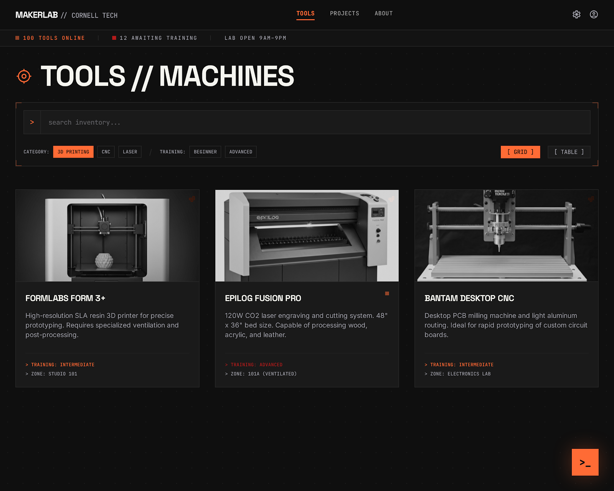
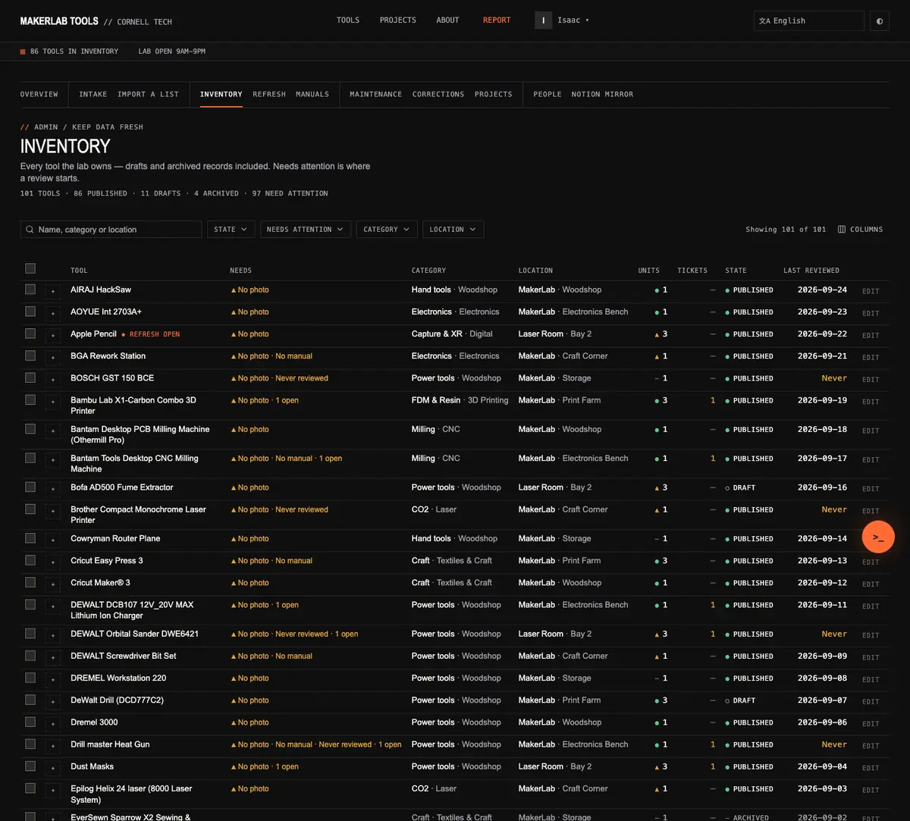
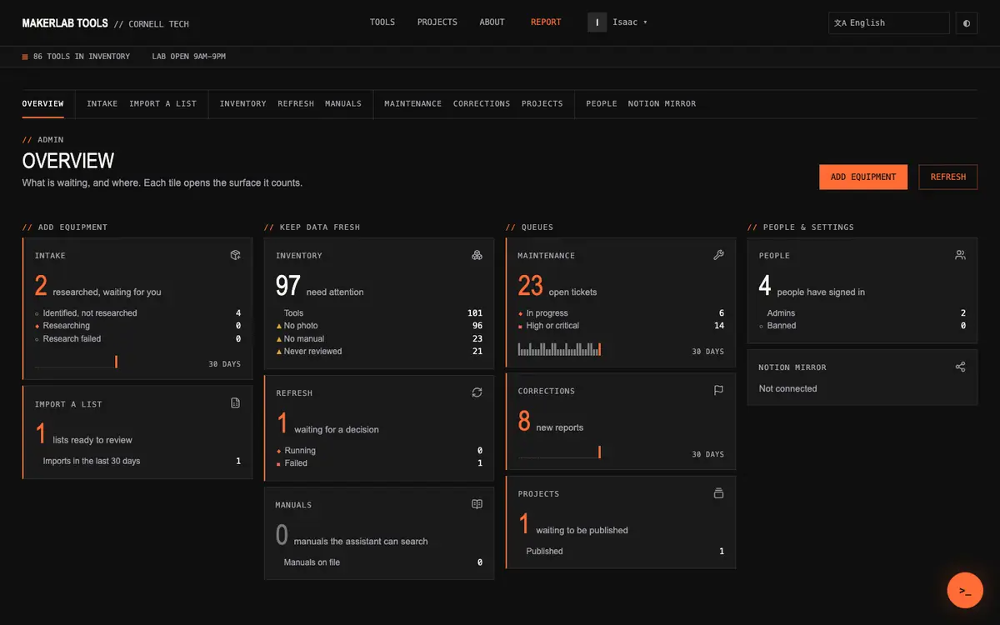
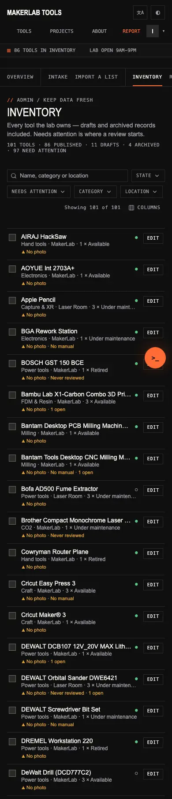
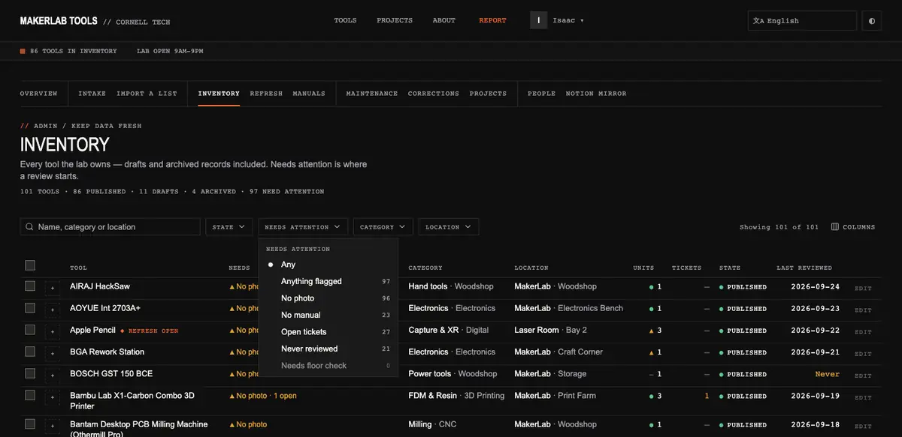
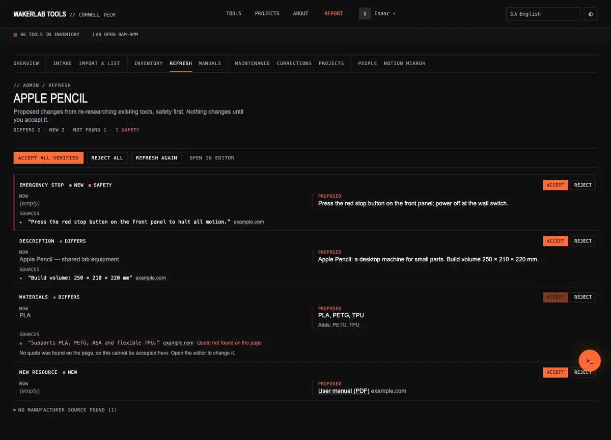
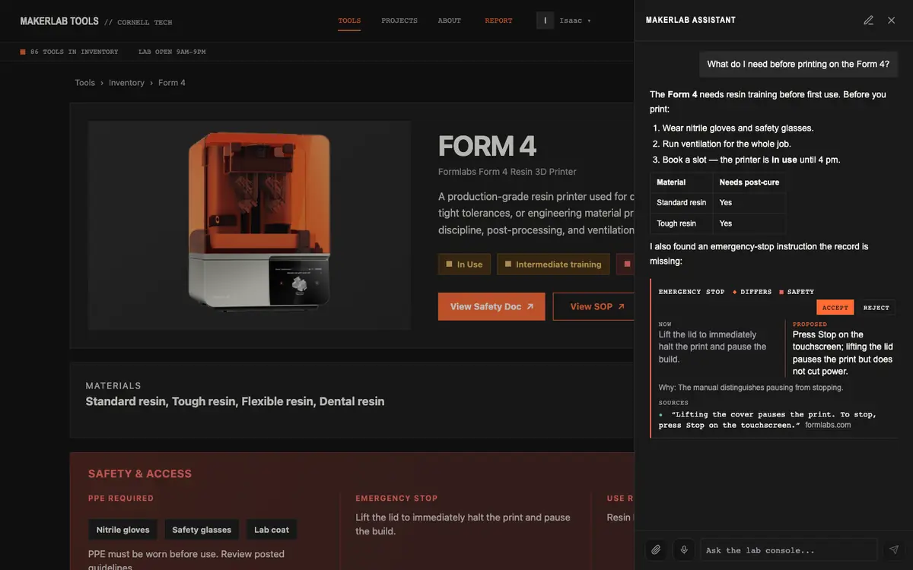

# Design System: The Technical Schematic

> **Living document.** This file says how MakerLab Tools should look and behave.
> The change that moves the code onto it — shadcn/ui on Tailwind 4, AI Elements
> for the chat, the admin IA — is specified in
> [`docs/specs/2026-09-25-ui-system-design.md`](../specs/2026-09-25-ui-system-design.md).
> The spec says *what changes and in what order*; this file says *what good
> looks like* and outlives the spec. Screenshots live in [`screens/`](screens/);
> `screen.png` is the original concept render and remains the identity reference.
>
> *Revised 2026-09-25: identity kept; reconciled with Tufte's density rules and
> the shadcn/AI Elements token mapping; patterns section added (§8). Phase 4:
> tiles, navigation, tabs and the ⌘K palette refined (§8.2, §8.12); queues and
> status lines added (§8.13, §8.14). Phase 5a: sort and group-by (§8.4), empty
> and error pages (§8.9), public pages, the tool page and one-time secrets
> (§8.16–§8.18), header controls (§8.12).*

## 1. Creative North Star: "The Blueprint Archive"

A digital extension of the workshop floor: precise, utilitarian, industrial-
editorial. Square corners, monospace metadata, high-contrast type, a blueprint
grid as the structural guide. It should feel less like a website and more like a
well-made instrument panel — and, like an instrument panel, **it earns its
density**: every mark on the screen is a reading somebody needs.

Two influences, one result:

- **Architectural Brutalism** gives the identity: 0px radii, mono labels, Safety
  Orange, tonal plates instead of boxes.
- **Edward Tufte** gives the discipline: maximise data-ink, words and numbers and
  graphics together, small multiples, sparklines, no chartjunk. Where the two
  disagree (glass, gradients, glows), Tufte wins; those flourishes are retired (§5).

## 2. Principles

1. **Data-ink first.** No boxed cells, zebra stripes, vertical rules, shadows or
   decorative icons in data. Hairline rows at 10% ink; sections by whitespace and
   tonal shift.
2. **Numbers right-aligned, tabular, mono.** Dates ISO (`2026-09-24`).
3. **One accent for action.** Safety Orange = the primary action, where you are,
   and "waiting on you". Never decoration, never a status.
4. **Status = glyph + word.** `● ok ▲ warn ■ bad ○ idle ◆ waiting on you – settled`.
   Colour is never the only signal.
5. **Say the numbers.** Headers carry a facts line; menus show counts; a tile says
   what its number counts.
6. **Sparklines where a trend matters.** Word-sized, bars for daily counts, last
   value in the accent, described in words for screen readers.
7. **Small multiples.** Parallel things share one layout.
8. **Dense but calm.** 13px tables, ~34px rows, 11px mono labels, 4px grid.
   Density comes from removing chrome, not shrinking type.
9. **Honest states.** Zero is shown as zero; unknown says "could not be read";
   empty names its cause.
10. **Square, flat, snappy.** 0px radius, no shadows, 150–200ms linear motion.

## 3. Colour and surfaces

Light is the default (a daily lab reference); dark is a first-class alternate.
The tokens below are CSS variables on `:root`, swapped under
`[data-theme="dark"]` and under `prefers-color-scheme: dark` when no choice is
stored. shadcn's semantic names map onto them (spec §6.1); components never use
hex values.

| Token | Role | Light | Dark | shadcn name |
|---|---|---|---|---|
| `--background` | page | #F7F4EE warm paper | #0F0F0F | `background` |
| `--surface-container-low` | general content areas | #EEE8DE | #131313 | `muted` |
| `--surface-container` | cards, sheets, menus | #FFFFFF | #1A1A1A | `card`, `popover` |
| `--surface-container-high` | hover, nested, neutral fill | #E2D8CA | #2A2A2A | `secondary`, `accent` |
| `--on-surface` | text | #171717 | #F5F5F0 | `foreground` |
| `--on-surface-muted` | secondary text | #59524A | #A1A1AA | `muted-foreground` |
| `--primary` | Safety Orange **fills** | #FF6B35 | #FF6B35 | `primary` |
| `--ink-on-primary` | text on orange | #0F0F0F | #0F0F0F | `primary-foreground` |
| `--primary-ink` | orange **text, marks, focus** | #B8431A | #FF6B35 | `primary-ink`, `ring` |
| `--secondary` | Cornell Crimson, heritage stamp | #B31B1B | #B31B1B | `brand` |
| `--outline` | hairlines | #CFC6B8 | #2A2A2A | `border` |
| `--outline-strong` | control boundaries (3:1) | #8A8171 | #6E6A64 | `input` |
| `--rule` | table row rules | ink 10% | ink 10% | `rule` |
| `--status-ok` | ● | #2B7549 | #5CC98A | `ok` |
| `--status-warn` | ▲ | #8A5300 | #E0A23A | `warn` |
| `--status-bad` | ■, errors, destructive | #B31B1B | #F0645A | `bad`, `destructive` |

**Why two oranges.** Safety Orange on paper is 2.6:1 — fine as a fill behind
black text (6.8:1), illegible as text. So orange *fills* stay #FF6B35 everywhere,
and orange *ink* on light surfaces is #B8431A (5.0:1). In dark mode they are the
same colour. On the light `muted` plate (#EEE8DE) the ink is 4.47:1, a hair
under AA: orange text belongs on the page or a card, not on `muted`.

**Crimson is a stamp, not a signal.** It marks heritage (the brand lockup), never
errors in dark mode (2.8:1 there). Errors use `--status-bad`.

**The No-Line rule.** Do not separate major page sections with 1px lines; use a
tonal shift (`surface-container-low` against `background`). Hairlines are for
rows, controls and the one bar under the admin section nav.

**Nested depth.** Cards are plates machined out of the background: a
`surface-container` card on `background`, a `surface-container-high` hover. The
blueprint-dot pattern (1px, 32px, 3–8% ink) stays on the page background only.

## 4. Typography

| Role | Face | Size / line | Use |
|---|---|---|---|
| Display | Space Grotesk 500, uppercase | clamp(42–88px) / 0.92 | Gallery and tool hero **only** |
| Page title | Space Grotesk 500, uppercase | 26–30px / 1.05 | `PageHeader` |
| Number | Space Grotesk 500, tabular | 40px / 1 | Tile headline |
| Body | Inter 400 | 14–15px / 1.5 | Prose, ledes |
| Table | Inter 400 | 13px / 1.35 | Cells, review values |
| Label | JetBrains Mono 500, uppercase, 0.08em | 11px | Eyebrows, buttons, glyph words, nav |
| Micro | JetBrains Mono, uppercase | 10px | Column heads, captions |

Seven steps. **Metadata is always mono** ("UI plumbing": tags, timestamps,
column heads, the `// CORNELL TECH` lockup, `// ADMIN / INVENTORY` crumbs). The
fonts are self-hosted with `next/font/local`; a design that only works where the
fonts happen to be installed is not a design.

## 5. Elevation, shape, motion

- **Radius: 0.** Every corner is 90°. (Enforced globally.)
- **Shadows: none.** Depth is tonal stacking. The old "ambient 64px glow" for
  modals is retired; a sheet or dialog sits on a 28% scrim instead.
- **Retired flourishes:** glassmorphism on overlays, gradients on CTAs, pulsing
  status dots. They cost ink and say nothing. The crosshair corners
  (`TechnicalFrame`) stay on the gallery hero only.
- **Focus: a 2px `--primary-ink` outline**, offset 2px, on `:focus-visible`,
  on everything interactive. Never `outline: none` without it.
- **Motion:** 150–200ms, linear or ease-in, colour and opacity only; nothing
  bounces; `prefers-reduced-motion` turns animation off.

## 6. Spacing and layout

- 4px grid: 4 · 8 · 12 · 16 · 24 · 32 · 48. Snap to it.
- Page gutter 16px on a phone, 32px from `sm`. No horizontal page scroll, ever;
  a wide thing (the section bar, a code block) scrolls inside itself.
- Breakpoints: `sm 640 · md 768 · lg 1024 · xl 1280`. Nothing else.
- Controls: 32px default, 28px in toolbars, 24px for row actions; touch rows ≥ 40px.

## 7. Iconography

`lucide-react`, 1.5–2px stroke, 14–16px, `currentColor`. Icons label *surfaces
and controls*; they are not decoration and never appear inside data cells, where
a status glyph (● ▲ ■ ○ ◆ –) does the job in a tenth of the ink.

## 8. Patterns

Each pattern names its component (`src/components/system/*`, `ui/*`,
`ai-elements/*`), when to use it, and what not to do.

### 8.1 Page header — `PageHeader`

`// ADMIN / KEEP DATA FRESH` crumb (mono, the `//` in accent) → title → one-line
lede → **facts line** (`101 TOOLS · 86 PUBLISHED · 11 DRAFTS · 97 NEED ATTENTION`)
→ actions on the right.

- **Use** on every working page (admin, account, projects, mcp).
- **Don't** stack a display heading above it (the old 88px "ADMIN"); don't put
  more than one filled button in the actions.
- Gallery and tool page keep their display heroes.
- **Sticky chrome never hides what it scrolls to.** The nav and status strip
  stick (`--sticky-chrome-height`); inside the admin, every heading, link,
  button and anchor target has `scroll-margin-top` of that height plus 16px, so
  focusing the header's actions with Tab, or following a `#` link, lands them
  below the strip instead of under it. Content scrolled past by hand goes
  under the opaque strip, which sits above it (`z-index: 20`); nothing in the
  admin sets a z-index that competes with it.

### 8.2 Tiles — `Tile`, `TileGroup`, `TileGrid`

Whole tile is the link. Every tile has the same anatomy, in the same places:
**label row** (mono title left, icon right) → **headline** (40px tabular
number and the words for what it counts, on one baseline) → **facts table** →
optional 30-day **sparkline** with a `30 DAYS` caption, **pinned to the tile's
foot**. Accent left border and accent number when the headline is **work
waiting for a person**; muted number when it is 0. Tiles side by side read as
small multiples.

- **Use** for the admin home: one tile per surface, grouped by job, only the
  surfaces the viewer may open (`surfacesFor`), each counted by its own loader
  so one unreadable table costs one tile.
- **Facts are a three-column table** (`glyph | label | value`), the same on
  every row: a fixed glyph column (empty when the row has no glyph), the label,
  and the number right-aligned in one tabular mono column. So every label
  starts at the same x and every number ends at the same x, glyph or not. Never
  indent a row with padding or an invisible glyph — the column is reserved on
  every row. A zero is a muted `0`, so the non-zero counts stand out. The
  table is at most 24rem wide, so on a wide tile the numbers stay near their
  labels.
- **Groups are bands** (owner, 2026-09-25). Each group is a heading over a row
  of cells, spanning as many grid columns as it has cells; groups flow into the
  home's grid (`TileGrid`: one column on a phone, two from `sm`, four from
  `xl`) and each is a CSS subgrid, so the groups in one band share their
  heading row and their tile row. At 1440 that is two rectangular bands —
  `ADD EQUIPMENT | KEEP DATA FRESH` (1 + 3) over `QUEUES | PEOPLE & SETTINGS`
  (3 + 1) — every tile in a band the same height, every heading on one line,
  no column left empty under a short group. At two columns a group takes the
  full width and a group's last odd cell spans both columns. One column on a
  phone, in the same order.
- **Half tiles pair.** A surface with only a number or a state — People, the
  Notion mirror, Projects with nothing waiting, a count that could not be read
  — is a **half tile** (`size="half"`: 28px number, no trend). Consecutive half
  tiles in a group share one cell, stacked (side by side when the cell spans
  two columns), so two stand where one full tile would. A lone half tile takes
  a cell of its own and stretches to the row's edges.
- **Say what the number counts**, in the unit and the facts, whenever another
  number on screen could seem to contradict it: the Inventory tile's "of 104
  tools need attention" sits beside "Published — in the catalog 100" and
  "Drafts and archived 4", because the status strip's "100 tools in inventory"
  counts published tools only.
- **Sparklines are readable at a glance**: bars at 75% ink, a zero day a 2px
  stub at 40%, today in the accent ink.
- **The link's name is the title**; the number and facts are its description,
  so a links list reads "Inventory", not a paragraph.
- **Accent means waiting work above zero** — open tickets, researched items,
  new reports. A stock (tools needing attention, people) is ink, however big.
- **Don't** show a count that failed as 0 (say "Could not be read", and drop
  the facts and trend with it); don't add a sparkline to a stock that doesn't
  change daily; don't use tiles as a gallery; don't put the tile's counts in
  the section bar.

### 8.3 Data table — `DataTable`

13px, ~34px rows, hairline row rules, no vertical rules, no zebra. Sticky header
(mono 10px). Numeric columns right-aligned tabular mono. Status column is
`StatusGlyph`. A 24px thumbnail at most. The row's reasons-for-attention as
**words** in warn ink (`▲ No photo · No manual · 1 open`). Row actions are
`ghost xs` and brighten on hover/focus. Keyboard: ↑↓/j k move, Space/x select,
Enter opens. Selection shows a sticky bulk bar (`2 TOOLS SELECTED · [REFRESH
RESEARCH (2)] · CLEAR`). On a phone: a two-line list item per row.

- **Use** for any list of records a person scans, sorts or selects.
- **Sort state is on the `th`** (`aria-sort`), never on the button inside it.
  The row's name is its `th scope="row"`.
- **Zero is a muted `0`; a dash is "not applicable yet"** (an import not read
  into rows). Neither is ever "None".
- **Selection survives filtering, and says so**: `3 TOOLS SELECTED · 1 NOT
  SHOWN BY THE FILTERS`. Select-all takes the rows shown.
- **Sticky header only when the page scrolls the table**, on the page
  background; a short table on a card is not sticky. A short, narrow table
  (seven rows, two columns) may stay a table on a phone and scroll inside
  itself; anything longer or wider gets the two-line list.
- **Phone: one of the two, not both.** The list and the table are never both
  in the document once the browser can say which shows, so a row's controls
  (a role select, a ban button) exist once.
- **A table in a panel follows the panel.** In the chat (360–440px on any
  screen) the table's own width decides (`layout="container"`), so the intake
  table is a list there on a 1440px desktop too, with its own select-all.
- **A row that cannot be selected says why**: its box is disabled and
  described by the reason (an undecided duplicate); select-all skips it.
- **Don't** render a table as cards on a phone; don't box cells; don't put more
  than one line of secondary text in a cell; don't hide the count.

### 8.4 Filter bar — `FilterBar`, `FacetFilter`, `ColumnsMenu`

Search (left) → one facet button per dimension (`STATE ▾`, `NEEDS ATTENTION
Never reviewed ▾` when set) → Clear → `Showing 21 of 101` → Columns. A facet menu
lists values **with the count each would leave**, disables values that leave
nothing, and filters are written to the URL so a view is a link.

- A chosen facet names its value on the button (`STATE Draft ▾`, read as
  "State: Draft"); its border moves to the accent ink.
- A short fixed choice **inside a row or a form** (a role) is a
  `NativeSelect` — a real `<select>`, the phone's own picker — bounded by
  `--outline-strong` like `Input`. A choice that has only one sensible answer
  is not a choice: say it as text (a token's expiry, "90 days, one semester").
- **Sort and Group by** (`ChoiceMenu`) sit at the end of the bar and look like
  facets, but narrow nothing: no counts, no "Any", always a value; the value is
  in the accent ink only when it is not the default. The default sort is the
  list's own order ("Best match" while searching).
- **Grouped, a list is labelled sections** in order — "not recorded" last —
  each heading sticky under the top bar (mono label, the count at the end:
  `3D PRINTING › FDM ······ 4 TOOLS`). Every section has the same layout and,
  as tables, the same column widths (small multiples); the sort applies inside
  each section. Items under a group heading drop a heading level.
- **Everything is in the URL** — search, facets, view, sort, group — even on a
  cached page (`useUrlSearch`: defaults on the server, the URL after hydration).
- **Don't** use native selects for facets; don't filter server-side on each
  keystroke; don't show an empty table without naming the filter; don't let
  the bar's end group push the page sideways on a phone (it wraps).

### 8.5 Status glyphs — `StatusGlyph`, `Glyph`

| Glyph | Tone | Means |
|---|---|---|
| ● | ok | settled and good: published, available, searchable, verified |
| ▲ | warn | needs a person soon: never reviewed, no manual, medium |
| ■ | bad | broken or urgent: failed, out of service, critical, quote not found |
| ○ | idle | nothing to do / not started: draft, queued, none |
| ◆ | active (accent) | waiting on *you*: proposed, researched, new |
| – | muted | archived, retired, decided |

Always with the word (visible, or `sr-only` in `compact` cells). **Don't** use a
coloured dot alone, a pill background, or Badge for status.

**Glyphs only where they carry meaning** (owner, 2026-09-25). A glyph is a
flag for the eye; one on every row is noise, and a hollow ○ beside "Running"
reads as a spinner. In a tile's facts, and anywhere a count is listed:

- **▲ warn** and **■ bad** mark a row **only when its count is non-zero**
  (No photo 3, High or critical 5, Failed 1); **◆ active** marks work waiting
  on you when non-zero (Identified, not researched 2). A row that says it
  could not be read is ■ bad.
- **A zero or neutral row has no glyph** — the reserved glyph column stays
  empty, and a zero is a muted `0`. Neutral means a stock or a state that asks
  nothing of anyone: Published, Handled, Manuals on file.
- **In progress has no glyph.** Running, Researching and a ticket in progress
  are being handled; the label says so, and a mark would claim they need
  someone. There is no in-progress tone, and ○ idle / ● ok are not used in
  facts (they remain for status *cells*, where every row has a status).
- The rule is enforced in one place (`factGlyph` in `system/Tile.tsx`), so a
  caller cannot put a glyph on a zero.

### 8.6 Review / proposal card — `ReviewCard`

One decision per card: `LABEL  marks  [ACCEPT] [REJECT]` on one line; NOW (muted)
│ PROPOSED (ink, orange rule) side by side, stacked on a phone; SOURCES as
verbatim quotes with host and ● verified / ■ not found; a note when it cannot be
decided here. Safety cards carry a bad-tone left rule. Decided cards fade.

- **Use** for refresh proposals, chat proposals, intake records, import rows —
  anything a person accepts or rejects.
- **A new record has no NOW.** The intake approve page is one card per field
  group (names, safety and training first, description, where it goes, links),
  all proposal, editable in place through `Field`. A field waiting on a
  person's decision (training "staff to confirm") carries a warn rule and says
  why in its hint.
- **Tones:** safety = bad rule; `warn` = a decision still owed (low confidence,
  an undecided duplicate); settled = faded. The mono meta line under the label
  says who and when; a failed run's reason is a `ReviewDiagnosis` (mono,
  bad rule), shown as recorded.
- **Duplicates are a `DuplicateChoice`**: ▲ the match in words, then the
  choices as a radio group of small buttons. Choosing saves, so the arrow keys
  never choose — each option is its own tab stop. A decision that cannot be
  changed here is shown as ● words, not controls.
- **Don't** render values as HTML/Markdown (they come from web pages); don't
  offer Accept on unverified evidence; don't box each card (a rule is enough);
  don't pass a border colour to a card (it overrides the tone's rule).

### 8.7 Forms

Label above (mono 10px uppercase), control (hairline box, `--outline-strong`,
square), hint below (12px muted), error below in `bad`. One filled primary button
at the end; Cancel is `quiet`. A form that belongs to the page is inline; a
decision gets a `Dialog`.

- **Don't** rely on placeholder as label; don't disable Submit without saying why.

### 8.8 Dialogs and sheets — `Dialog`, `Sheet`

`Dialog` for a decision (confirm, report a correction, research again); `Sheet`
(side panel, full screen on a phone) for a workspace (tool editor, chat). Both
trap focus, close on Escape and return focus. Scrim 28% ink, no shadow.

- **Don't** mark something `aria-modal` that isn't; don't nest dialogs.

### 8.9 Empty, loading, error — `EmptyState`, `Skeleton`, `RowStatus`

- **Empty**: one sentence naming what is missing and why, plus the next action
  ("No tools match State: Archived. [Clear filters]").
- **Loading**: skeleton rows in the table's shape; a spinner only inline.
- **Error**: say what failed and that nothing was lost; failing toward stale is
  shown, not hidden (Article 4). Row actions report inline (`RowStatus`).
- **Pages**: a 404 and an error boundary are pages in the system's frame
  (`PublicPage` + `EmptyState`; the error one `tone="bad"` with Try again),
  never the framework's bare default.
- **A missing image** is an empty plate with the thing's initials in mono,
  never the browser's broken-image icon.

### 8.10 Buttons — `Button`

| Variant | Look | Use |
|---|---|---|
| `default` | orange fill, #0F0F0F mono label | the one primary action on a surface |
| `quiet` | hairline box, ink label | everything else (default) |
| `outline` | orange-ink hairline + label | a secondary call to action on public pages |
| `ghost` | label only, muted | row actions, toolbars, Clear |
| `destructive` | bad-tone hairline + label, at rest | discard, delete, ban — confirm inline |
| `link` | orange-ink underlined | inline navigation |

**One-shot actions keep their state in the button — `AsyncButton`**
(`src/components/system/AsyncButton.tsx`). For an action that runs once and is
over — Refresh catalog, Looks good, Re-process — the button is the status:
idle (the label) → pending (a small spinner over the label, which stays in
place invisible so the **width never changes**; disabled, `aria-busy`) → done
(a check and `DONE` for 1.5 s, announced through a live region, then the label
again) → error (the label again, with the reason on a `RowStatus` line beside
it). No sentence left standing next to the button, no toast. A button's label
names its object when a neighbour could be confused with it: **Refresh
catalog** (the cache) is not **Refresh research** (the surface).

### 8.11 Chat — AI Elements

Docked side sheet (440px; full screen on a phone). `Conversation` (live log,
sticks to bottom, "scroll to latest" button) → `Message`: assistant text is
unboxed prose; the user's turn is a square `secondary` block; cards (`ReviewCard`,
intake table, import card) span the full width. `Suggestions` stack as sentences
on the empty state. A running tool is a one-line status with a spinner (`Tool`
header). Manual citations render as `InlineCitation` + a `Sources` list — the
answer shows its evidence. `PromptInput`: attach, dictate, text, send.

- **Don't** use rounded bubbles or avatars; don't strip citations; don't open a
  floating card that can't fit the cards it contains.

### 8.12 Navigation and IA

- **Public**: `TOOLS · PROJECTS · ABOUT · REPORT` in the top bar; status strip
  below (`86 TOOLS IN INVENTORY · LAB OPEN 9AM–9PM`). Report is the bar's one
  accent; **Sign in** is a hairline box in ink; the local-only **Sign in as
  (dev)** is muted and dashed and shortens to `DEV` on a phone. The profile
  menu is a plate with a hairline border — no glass, no glow.
- **Admin**: a section bar under the top bar on every admin page:
  `OVERVIEW ┃ INTAKE ┃ INVENTORY · REFRESH · MANUALS ┃
  MAINTENANCE · CORRECTIONS · PROJECTS ┃ PEOPLE · NOTION MIRROR ┃ ⌕ SEARCH ⌘K`,
  dividers between jobs, the most specific current page underlined in the
  accent (an item's page marks its surface), only surfaces the viewer's
  permissions open, **no counts**. On a phone it scrolls inside itself. The
  one list behind the bar, the home and the palette is
  `src/lib/admin/surfaces.ts` — a page added there appears in all three.
- **Page header**: `// ADMIN / GROUP` (plus `/ SURFACE` as a link on an item's
  page) → title → lede → facts line → actions (`AdminPageHeader`).
- **Tabs that are pages** (`LinkTabs`): Intake's `QUEUE · IMPORTS` under one
  header. Links with `aria-current`, not `role="tab"` — each tab is a URL; a
  tab the viewer cannot open is not shown.
- **One surface per job's page, actions in the header.** Adding equipment is
  one surface, **Intake**: importing a list is its header action (`IMPORT A
  LIST`), not a surface, tile or palette entry of its own. A page's primary
  action sits in its header's actions — Inventory's `ADD INVENTORY`, Refresh's
  `REFRESH RESEARCH…` (a dialog that picks the tools), Intake's `IMPORT A LIST`.
- **⌘K palette** (`CommandPalette`): `ADMIN PAGES` (with their group),
  `ACTIONS` (Add equipment, Refresh the catalog), `TOOLS` (display name, the
  official name muted, `DRAFT` marked). Every word typed must match; nothing
  fuzzy. `/` jumps to the page's filter search. The assistant joins it in
  phase 5 ("Ask the assistant: …").
- **Don't** make a page reachable only through a hub; don't list a surface that
  will refuse the viewer; don't put waiting counts in the bar; don't use
  `role="tab"` for navigation.

### 8.13 Queues — `QueueList`

Maintenance, corrections, projects and intake are one layout: `FilterBar`
(search + facets counted over every item) → the open work, one `ReviewCard`
each (status and priority as glyphs, who and when on the meta line, the
controls under the words) → `▸ SHOW 5 RESOLVED AND CLOSED`, a disclosure
holding the settled work, filtered too.

- **Open work is the page**; settled is one click away, never gone.
- A filter that empties the open list **names itself** (`Nothing here matches
  "belt" · Priority: High`) with Clear. An empty queue says what fills it and
  shows no filter bar.
- **Typed fields are a button until wanted.** A card's click-to-save controls
  (status, priority, assignee) are always there; a field somebody writes a
  sentence into (a ticket's resolution) is `ADD RESOLUTION`, or the saved words
  on two clamped lines with `EDIT RESOLUTION`, until pressed — then the box
  opens inline, focused, with Save and Cancel; Escape cancels; focus returns to
  the button; the outcome is the card's `RowStatus`.
- Cards may be grouped (intake by batch); the layout stays the same.
- **Don't** split a queue into Open / Settled tabs; don't box the cards; don't
  hide the controls behind a row click on a phone.

### 8.14 Status lines — `RowStatus`

One inline line for an action's outcome, in the muted, warn or bad ink:
`Saving… → Saved`, a warning when a change landed minus a guarantee, the
refusal's reason. Always in the DOM as a live region, empty until it speaks.
**"Saved" only for a write that landed**: a control that saves on change is
disabled until the page has hydrated (`useHydrated`), a change to the value it
already holds sends nothing, and an answer that does not match the choice is a
failure, not a success.
No toasts (owner decision). A page that could not read its data says so with
`EmptyState tone="bad"`, never an empty list.

### 8.15 Mobile behaviour

- 390px is a first-class width: tables become two-line lists, before/after
  stacks, bars scroll inside themselves, sheets go full screen.
- 16px gutters; no horizontal page scroll; touch rows ≥ 40px.
- The chat launcher must never cover the one action on screen (bulk bars reserve
  its corner; admin opens chat from the nav).

### 8.16 Public pages — `PublicPage`, `PageSection`, `Markdown`

Projects, about, `/mcp`, account and OAuth pages share one frame: a reading
column on the page background (880px; 560px for a single decision; the page
width for a grid of cards), `PageHeader` as the h1 (`// MCP SERVER` crumb,
title, lede, facts, the one filled action), then sections separated by
whitespace — an h2 in Space Grotesk and an optional muted lede.

- Prose is 15px at a readable measure, links in the accent ink.
- Markdown written by people or research renders through `Markdown` (GFM, no
  raw HTML), in the page's tokens — never the chat's styles.
- **Don't** put a page in a rounded card, stack a display heading on a working
  page, or box each section.

### 8.17 Tool page

One column of facts, not panels: crumb → hero (image plate | display title,
the official name in mono, a status line of glyphs and words, the
description, Safety doc / SOP) → **Safety**, the one tinted section (bad start
rule) → **Details** as a dense `<dl>` beside **Documents & resources** as a
ruled list (the kind as a mono word, the manual's Contents under it) →
**Physical machines** (`DataTable`) → **Maintenance history** (date, status
glyph, title, unit — never who reported it) → **Built with this**.

- Say a fact once: no "at a glance" card repeating the specs.
- **Don't** colour a chip for status (use the glyph line) or tint any section
  but Safety.

### 8.18 One-time secrets — the token reveal

A secret shown once (a personal access token) appears in the same column as
the form that made it, on a warn-ruled plate: ▲ **"Save this token now. You
won't be able to see or copy it again after you leave this page."** above the
secret, the secret in a copyable block, what to do next (an environment
variable, then the client), and the same sentence again **beside the button
that dismisses it**. Nothing else on the page holds the secret, and nothing the
page offers to copy — a setup prompt for an assistant included — contains it:
prompts name the environment variable instead.

- **Copy setup prompt for your AI**: a short prompt, one Copy button, sign-in
  first; a token only from `MAKERLAB_MCP_TOKEN`, never pasted into a chat.

## 9. Do's and Don'ts

**Do**
- Snap to the 4px grid and the seven type steps.
- Put the label top-left and the value bottom-right: a technical-document flow.
- Say the numbers in words beside the graphics.
- Use one accent, once per surface, for the action.

**Don't**
- Round a corner, cast a shadow, add a gradient, blur glass.
- Use Crimson for large surfaces or for errors in dark mode.
- Use orange text on paper (use `--primary-ink`).
- Encode status in colour alone.
- Invent a new table, badge, button or dialog: use the system component, or add
  one to `src/components/system` when a pattern appears on a second surface.
