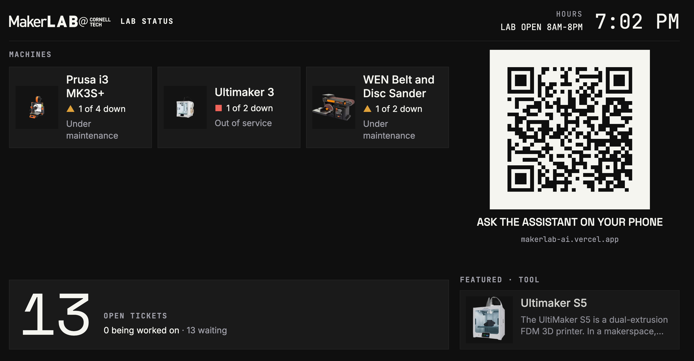
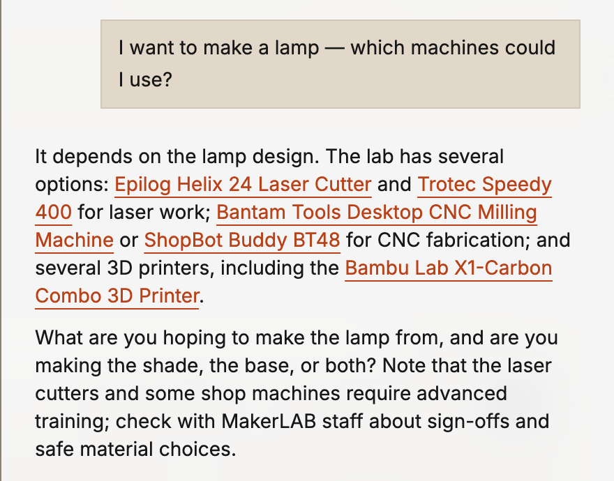

<!--
  ISAM 2026 demo extended abstract, V2. THIS FILE IS THE SOURCE OF TRUTH.
  Edit it, then rebuild the HTML and the PDF with one command from the repo root:

      node docs/isam-2026-demo/build.mjs

  It writes abstract-v2.html and "MakerLAB AI - ISAM 2026 Demo V2.pdf" next to this
  file (headless Chrome), and prints the abstract's word count (limit 300) and the
  PDF's page count (must stay 2). Syntax: see the header of build.mjs. Comments like
  this one never reach the PDF.
-->
---
venue: International Symposium on Academic Makerspaces — ISAM 2026
title: MakerLAB AI: AI to Help Operate, Fix, and Build in Makerspaces
authors: Isaac Steinberg^1^, Niti Parikh^2^, and Miguel Ramirez Peraza^3^
affiliations:
  - ^1^Isaac Steinberg; MBA '26, Johnson Cornell Tech; ies22@cornell.edu
  - ^2^Niti Parikh; Director, Learning Spaces & MakerLABs, Cornell Tech; ntp27@cornell.edu
  - ^3^Miguel Ramirez Peraza; MakerLAB Intern, Cornell Tech; ramirezperazamiguel@gmail.com
pdf: MakerLAB AI - ISAM 2026 Demo V2.pdf
---

## Abstract

Academic makerspaces run on operational knowledge (manuals, setup procedures, safety rules, inventory and repair history) that sits in shared drives, vendor sites and staff memory, mostly in English. At the Cornell Tech MakerLAB, students arrive at every skill level and staff are not always on the floor, so that knowledge reaches them unevenly. We ask whether an AI grounded in a lab's own inventory and records can help students **operate** machines, **debug** and **fix** them, and **create** multi-machine builds without waiting for staff, and what keeps it honest, safe and cheap. We demonstrate **MakerLAB AI**, the assistant inside *MakerLAB Tools*, a web platform, its code public, in use at the lab. Its answers cite the lab's catalog and a searchable archive of about 54 machine manuals (≈2,400 pages) down to the page, and it says when a manual is silent. Students file maintenance tickets from the chat, and the AI offers to file one while it helps debug and fix. Staff add equipment from a photo or a list: research to create a curated tool record runs in the background and nothing is published until a person approves it. Printed QR labels make each machine its own entry point: scanning one, or photographing it in the chat, opens that machine's page, manuals and assistant. A kiosk shows live machine status, a projects gallery links student work to the machines that made it, and anonymous usage insights estimate staff hours saved and after-hours coverage. Built AI-first, the catalog, manuals and everyday actions are also served over the Model Context Protocol (MCP), so visitors can use the lab from their own AI client. The interface is in 12 languages, and the assistant answers in the student's language.

## 1. Motivation and Research Question

The project began on the Cornell Tech MakerLAB floor. An intern built the first inventory search; a student volunteer "SuperMaker" kept hunting down manuals to fix the laser cutters and 3D printers; the Director asked whether a student could *describe a project* and have an AI help plan it. The same three needs keep coming up, and today each one goes to a person: to **operate** a machine (where is it, how do I start, what training and PPE?), to **debug** and **fix** it when it faults mid-job, and to **create**: plan a build across several machines. Our question is whether one assistant, grounded in the lab's own records rather than the open web, can meet all three at any hour, and what guardrails make that trustworthy enough for a shared shop. Names: the **MakerLAB** is the lab, **MakerLAB Tools** the platform, **MakerLAB AI** the assistant.

## 2. System

**From research to records.** MakerLAB Tools (Next.js on Vercel, live at [makerlab-ai.vercel.app](https://makerlab-ai.vercel.app); overview at [/product](https://makerlab-ai.vercel.app/product)) turns what the AI researches into structured records. It keeps tools, individual units, locations, resources, maintenance tickets and projects in Postgres with file storage, and mirrors them one way to Notion, where staff already work. Each of about 100 tool pages shows training, PPE, location, manuals and SOPs, and every unit's status.

**Grounded answers.** This is retrieval-augmented generation (RAG), automated end to end: manuals and SOPs are archived, their text extracted (scanned PDFs are read with OCR), split into passages and indexed for hybrid keyword-and-vector search with reranking. The assistant searches them and cites the page it used (Fig. 1); when nothing supports an answer, it says so and sends the student to staff for safety and sign-offs. Opened on a tool page, the chat starts from that machine's record and manuals.

**Acting, with a person in the loop.** Students describe a problem in plain language; the AI asks what it needs to file a repair ticket against the right unit, and walks them through the fix when the manual covers it. Staff add inventory at scale, from a photo or a pasted list: the model identifies each item, background research gathers manuals, specifications and a product image (a deterministic cutout, never a generated redraw), and a staff member approves each draft before it is published. Research, photo clean-up and manual indexing run as durable workflows (Vercel Workflow): each step is checkpointed and retried, so long AI jobs with side effects (fetches, uploads, database writes) survive timeouts without redoing work or duplicating records. The assistant is offered exactly what the signed-in user could do in the interface, but never acts itself: it shows a confirmation card drawn from the database, and nothing changes until the person presses Confirm. Irreversible changes require typing the item's name, and after reading outside text (a web page, a manual, a ticket) it refuses changes to people or anything irreversible.

**Starting from the machine.** Staff print QR labels from the inventory page, singly or by the sheet; a label opens that tool's page with its manuals and the assistant, and a phone photo of a label in the chat is decoded on the server, so the assistant knows which machine a student is standing at. Without a label, it matches a photo of the machine itself to the catalog, asking when look-alikes are ambiguous. For signed-in students a floor map shows where each tool is, and a project page lights up the zones its tools are in, so a build can be planned as a walk through the lab. Suggested questions are run through the assistant ahead of time and graded against the manuals; weak ones are rewritten and good answers are cached, so a first tap answers instantly and already checked.

**Public dashboard.** A full-screen kiosk (Fig. 2) shows down machines, open tickets, hours and a QR code that opens the assistant on a visitor's phone. A projects gallery links each project to the machines used. Anonymous usage insights estimate staff hours saved and after-hours coverage. A Model Context Protocol (MCP) [1] endpoint lets any MCP client, such as Claude [2] or ChatGPT [3], list tools, read units and maintenance history and search the manuals. The code is public [4].

## 3. Process and Results

The system is built spec-first: each feature starts as a written design with open questions for the engineer and ships with automated tests (6,831 offline tests on 30 Sep 2026). Model behaviour is checked by a paid evaluation harness of 59 conversational cases (the three needs, citations, honest "I don't know", staff actions, refusing unsafe changes). **Early use.** Designing a 3D-printed case for a device with an AI coding agent, the first author let the agent query the lab's inventory over MCP: it found which printers were available and their build volumes, and the case was sized to fit before anything was printed: the *create* need in practice. Costs are in cents: about 0.25¢ for a chat turn that searches a manual (most of it the reranker), 2–5¢ to research a new tool, and 1.3¢ to index 20 manuals. Fig. 3 shows a *create* answer.

## 4. The Demonstration

Visitors use the live system at three stations. **Browse and ask (laptop):** they browse the inventory, open a machine page, and ask the assistant how to operate, debug or fix it, or how to make something with the lab's machines; answers cite the manual page, and a printed QR label on a sample tool opens its page. **Bring your own AI (second laptop):** Claude or ChatGPT, connected to the MCP endpoint, searches the same inventory and manuals from outside the site. **Add to the inventory (phone):** in a demo copy of the app, they photograph an object and watch it become a researched draft awaiting approval. The kiosk runs on a TV throughout, on live lab data. **Requirements:** one table, power, reliable Wi-Fi, and a monitor or TV.

## 5. Discussion and Next Steps

The assistant is deployed; its effect on students is not yet measured. The insights page logs, anonymously, what is asked, what goes unanswered and when; this term we will compare ticket volume, machine downtime and after-hours questions against staff estimates. Limits: answers are only as good as the archived manuals, many of which are thin on troubleshooting. Next: AI planning for digital fabrication across the lab's machines, recurring maintenance, notifications, and a framework other labs, starting with Cornell's other campuses, can adopt while keeping their own identity.

## Acknowledgements

We thank the MakerLAB staff, the SuperMakers and interns at Cornell Tech and Cornell University, and the students who make the lab. **Use of generative AI (ISAM policy):** Isaac Steinberg designed the system and directed and reviewed all of its code, which was written with the AI coding assistants Claude Code (Anthropic) and Codex (OpenAI). This abstract was drafted and revised with Anthropic's Claude from the authors' notes and the project's specifications; the authors checked each claim and figure against the running system. The answers in Figs. 1 and 3 are unedited output of the deployed assistant (commercial models via the Vercel AI Gateway).

## References

[1] Anthropic, "Model Context Protocol," 2024. [Online]. Available: https://modelcontextprotocol.io. [Accessed: Sep. 28, 2026].

[2] Anthropic, "Claude," 2023. [Online]. Available: https://www.anthropic.com/claude. [Accessed: Sep. 28, 2026].

[3] OpenAI, "ChatGPT," 2022. [Online]. Available: https://openai.com/chatgpt. [Accessed: Sep. 28, 2026].

[4] I. Steinberg, "MakerLAB Tools," GitHub repository, 2026. [Online]. Available: https://github.com/philosophercode/makerlab-tools. [Accessed: Sep. 28, 2026].
