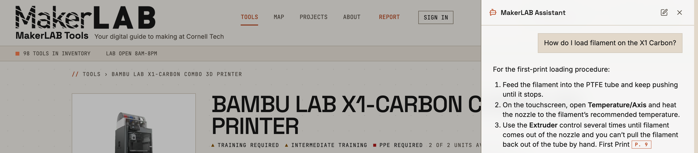
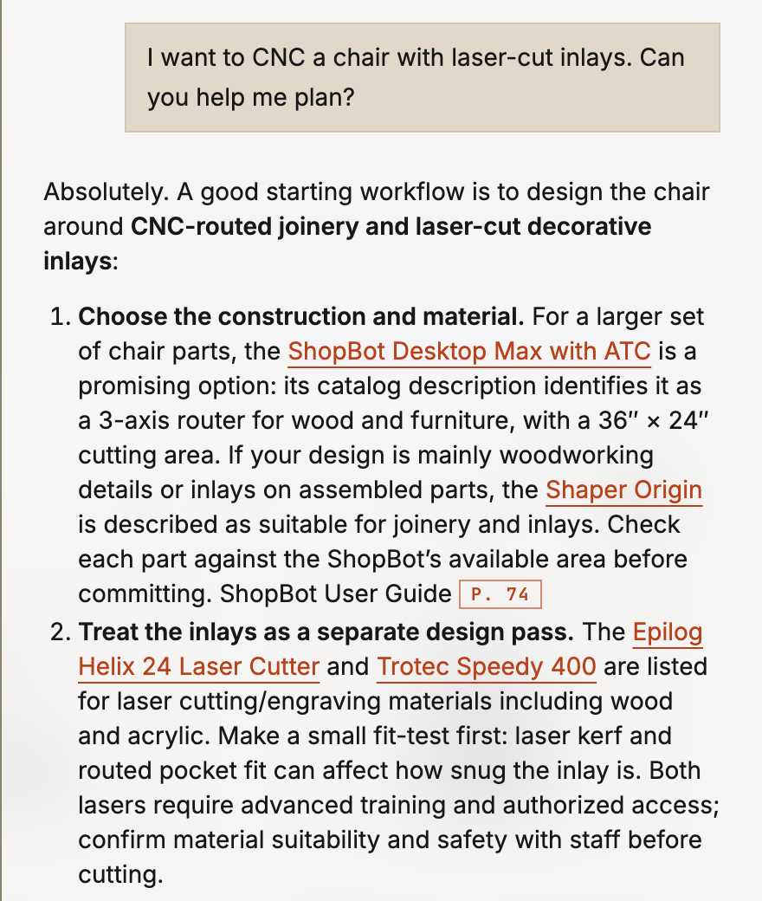

<!--
  ISAM 2026 demo extended abstract, V2. THIS FILE IS THE SOURCE OF TRUTH.
  Edit it, then rebuild the HTML and the PDF with one command from the repo root:

      node docs/isam-2026-demo/build.mjs

  It writes abstract-v2.html and "MakerLAB AI - ISAM 2026 Demo V2.pdf" next to this
  file (headless Chrome), and prints the abstract's word count (limit 300) and the
  PDF's page count (must stay 2). Syntax: see the header of build.mjs. Comments like
  this one never reach the PDF.
-->

---

venue: International Symposium on Academic Makerspaces — ISAM 2026 · 30 September 2026
title: MakerLAB AI: Tools to Operate, Fix, and Build in Makerspaces
authors: Isaac Steinberg^1^, Niti Parikh^2^, and Miguel Ramirez Peraza^3^
affiliations:

- ^1^Isaac Steinberg; MBA '26, Johnson Cornell Tech; ies22@cornell.edu
- ^2^Niti Parikh; Director, Learning Spaces & MakerLABs, Cornell Tech; ntp27@cornell.edu
- ^3^Miguel Ramirez Peraza; MakerLAB Intern, Cornell Tech
  pdf: MakerLAB AI - ISAM 2026 Demo V2.pdf

---

## Abstract

Academic makerspaces run on operational knowledge (manuals, setup procedures, safety rules, inventory and repair history) that sits in shared drives, equipment websites and staff memory, mostly in English. At the Cornell Tech MakerLAB, a Cornell University maker space in NYC, students arrive at every skill level and staff are not always on the floor, so that knowledge reaches them unevenly. We ask whether an AI grounded in a lab's own inventory and records can help students **operate** machines, **fix** them, and **build** multi-machine projects. The assistant answers questions, records issues and organizes inventory for pennies, freeing staff to work on larger projects, think creatively about using tools in new ways, and scale the number of tools the lab can hold. We demonstrate **MakerLAB AI**, the assistant inside *MakerLAB Tools*, a web platform, its code public, in use at the lab. Its answers cite the lab's catalog and a searchable archive of about 50 machine manuals (≈2,400 pages), down to the page. Students troubleshoot from the official product manuals, and the AI proactively offers to file a maintenance ticket from the chat. Staff add equipment from an unstructured note, a photo or a list. In the background, research agents identify the tool and curate a record, downloading its documents; nothing is published until a person approves it. Printed QR labels make each machine its own entry point: scanning one opens that machine's page, manuals and assistant. A kiosk shows live machine status, a projects gallery links student work to the machines that made it, and an insights page reports anonymous usage. Built AI-first, the catalog, manuals and everyday actions are also served over the Model Context Protocol (MCP), so visitors can use the lab from their own AI client. The assistant answers in each student's preferred language.

## 1. Motivation and Research Question

The project began on the Cornell Tech MakerLAB floor. An intern built the first inventory search; a student volunteer "SuperMaker" kept hunting down manuals to fix the laser cutters and 3D printers; the Director asked whether a student could *describe a project* and have an AI help plan it. The same three needs keep coming up, and today each one goes to a person: to **operate** a machine (where is it, how do I start, what training and PPE?), to **debug** it when it breaks mid-job, and to **create**: plan a build across several machines. Our question is whether one agent, grounded in the lab's own records and able to look things up online, can help with all three at any time, and what makes it useful, efficient and easy to work with.

## 2. System

**From research to records.** MakerLAB Tools [4] (Next.js on Vercel, live at [makerlab-ai.vercel.app](https://makerlab-ai.vercel.app); overview at [/product](https://makerlab-ai.vercel.app/product)) turns what the AI researches into structured records. It keeps tools, individual units, locations, resources, maintenance tickets and projects in a SQL database with file storage, and can write them one way to Notion, where our staff already work (optional). Each of about 100 tool pages shows training, PPE, location, manuals and SOPs, and every unit's status.

**Grounded answers.** This is retrieval-augmented generation (RAG), automated end to end: manuals and SOPs are archived, their text extracted (scanned PDFs are read with OCR), split into passages and indexed for hybrid keyword-and-vector search with reranking. Each lab adds its own SOPs, notes and documents to a tool, indexed with the manufacturer's manuals; the lab's SOP is the operating reference. The assistant searches them and cites the page it used (Fig. 1); when nothing supports an answer, it says so and sends the student to staff for safety and sign-offs.

**Proactive, with a person in the loop.** When a student describes a problem, the AI proactively drafts and files a maintenance ticket against the right unit, asking only what it needs, and walks them through the fix when the manual covers it. Tickets go to the staff queue with an email notification; a wrong answer can be reported from the chat as a correction. Staff add inventory from a phone photo, a note or a pasted list in seconds; in the background, in under a minute per tool, research agents turn that into the complete record that is tedious to enter by hand: manuals, specifications and a product image. A staff member approves each draft before it is published. They run as durable, retried workflows (Vercel Workflow). In the chat or over MCP, the AI can do anything the signed-in person could do in the interface, except a short list of admin-only, record-destructive actions it is never allowed; each change waits on a confirmation card until the person presses Confirm, and after reading outside text (a web page, a manual, a ticket) the server, not the prompt, refuses changes to people or anything irreversible.

**Starting from the machine.** Staff print QR labels from the inventory page, singly or by the sheet; a label opens that tool's page with its manuals and the assistant, and a phone photo of a label in the chat is decoded on the server, so the assistant knows which machine a student is standing at. Without a label, it matches a photo of the machine itself to the catalog, asking when look-alikes are ambiguous. For signed-in students a floor map shows where each tool is, and a project page lights up the zones its tools are in, so a build can be planned as a walk through the lab.

**Public dashboard.** A full-screen kiosk (Fig. 2) shows down machines, open tickets, hours and a QR code that opens the assistant on a visitor's phone. At the front of the MakerLAB it engages students as they walk in, tells them which machines are up, and introduces the assistant.

## 3. Process and Results

The system is built spec-first: each feature starts as a written design with open questions for the engineer and ships with several thousand automated tests, run on every change. Chat and research use OpenAI's GPT-6 Luna, with text-embedding-3-small embeddings and Cohere Rerank v4 Fast, through the Vercel AI Gateway. Model behavior is checked by an evaluation harness of 72 conversational cases (the three needs, citations, honest "I don't know" replies, staff actions, refusing unsafe changes). In a spot check of ten student questions on 30 Sep, eight got a complete, correct answer (four citing a manual page) and two were partial where the records lack the data (plywood settings, PPE); none was unsafe. Costs are in cents: about 0.25¢ for a chat turn that searches a manual (most of it the reranker), 2–5¢ to research a new tool, and 1.3¢ to index 20 manuals. Fig. 3 shows a *create* answer.

## 4. The Demonstration

Visitors use the live system at three stations. **Browse and ask (laptop):** they browse the inventory, open a machine page, and ask the assistant how to operate, debug or fix it, or how to make something with the lab's machines; answers cite the manual page, and a printed QR label on a sample tool opens its page. **Bring your own AI (second laptop):** Claude [2] or ChatGPT [3], connected to the MCP [1] endpoint, searches the same inventory and manuals from outside the site. **Add to the inventory (phone):** in a demo copy of the app, they photograph an object and watch it become a researched draft awaiting approval. The kiosk runs on a TV throughout, on live lab data. **Requirements:** one table, power, reliable Wi-Fi, and a monitor or TV.

## 5. Discussion and Next Steps

The assistant is deployed; its benefits to students are not yet measured. The insights page logs what is asked, what goes unanswered and when; this term we will compare ticket volume, machine downtime and after-hours questions. Limits: answers are only as good as the archived manuals, many of which are thin on troubleshooting, so a lab can add its own supplementary documents and notes. Next: AI planning and design for digital fabrication across the lab's machines, and a framework other labs can adopt.

## Acknowledgements

We thank the MakerLAB staff, the SuperMakers and interns at Cornell Tech and Cornell University, and the students who make the lab a creative and ingenious place to make. **Use of generative AI (ISAM policy):** Isaac Steinberg designed and architected the system and directed its code generation with the AI coding assistants Claude Code (Anthropic) and Codex (OpenAI). This abstract was drafted and revised with Anthropic's Claude from the authors' notes and the project's specifications; the authors checked each claim and figure against the running system. The answers in Figs. 1 and 3 are unedited output of the deployed assistant (commercial models via the Vercel AI Gateway).

## References

[1] Anthropic, "Model Context Protocol," 2024. [Online]. Available: [https://modelcontextprotocol.io](https://modelcontextprotocol.io). [Accessed: Sep. 28, 2026].

[2] Anthropic, "Claude," 2023. [Online]. Available: [https://www.anthropic.com/claude](https://www.anthropic.com/claude). [Accessed: Sep. 28, 2026].

[3] OpenAI, "ChatGPT," 2022. [Online]. Available: [https://openai.com/chatgpt](https://openai.com/chatgpt). [Accessed: Sep. 28, 2026].

[4] I. Steinberg, "MakerLAB Tools," GitHub repository, 2026. [Online]. Available: [https://github.com/philosophercode/makerlab-tools](https://github.com/philosophercode/makerlab-tools). [Accessed: Sep. 28, 2026].
