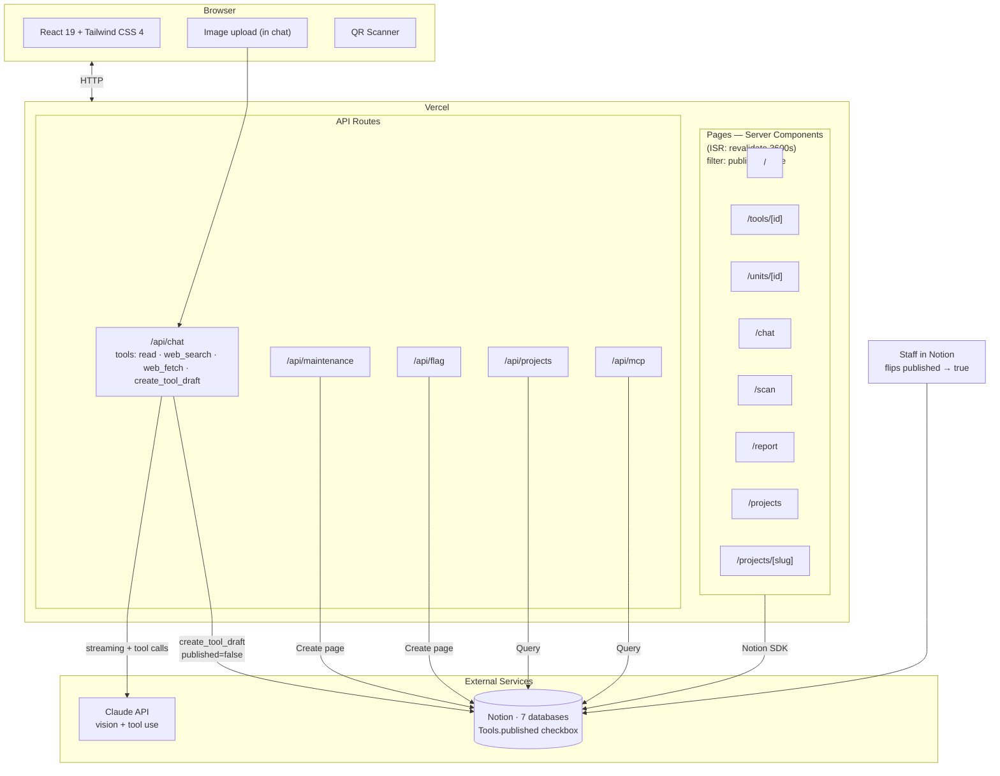

# MakerLab Tools v5 — Architecture Plan

> **Status:** Draft · **Author:** Isaac · **Date:** 2026-04-21
>
> This document describes three related changes planned for v5:
> 1. Migrating the data layer from **AirTable → Notion**.
> 2. Adding a new **Student Projects** section (scaffold only — not implemented in this plan).
> 3. Adding **AI-Assisted Tool Ingestion** to the chat — drop a photo, AI fills the row, drafts land in Notion for staff to publish.

---

## 1. Why v5

v4 works, but three friction points keep showing up:

- **AirTable is a data silo.** Staff already live in Notion for docs, SOPs, and onboarding. Keeping tool records in a separate system means double-entry whenever a tool gets a new manual, a new safety doc, or a policy update. Relations between "this tool" and "the doc page about this tool" today live as URL strings, not real links.
- **The catalog is read-mostly, but writes (maintenance reports, flags) need a human-friendly review surface.** AirTable's grid is great for that. Notion's database views + comments are arguably better, since reviewers can discuss individual reports inline.
- **Inventory ingestion is manual and slow.** Adding a new tool today means creating an AirTable row by hand, hunting for an image, copy-pasting safety info from a manual. Quality varies; staff put it off. v5 introduces an AI-assisted ingestion flow inside the chat (§5) so adding a tool becomes "drop a photo and confirm."

The v5 migration moves the source of truth to Notion while preserving the v4 Next.js frontend, the Claude chat tool-calling, and the MCP endpoint.

Two new features ride on top of the migration: **Student Projects** (a gallery section that exercises bi-directional Notion relations) and **AI-Assisted Tool Ingestion** (chat-based intake that lets the AI fill out tool records from a photo).

---

## 2. Target Architecture



**What changes:**
- `src/lib/airtable.ts` → `src/lib/notion.ts` (same public shape; different backend).
- New `/projects` routes and `/api/projects` route.
- Chat route gains write capability: one new tool `create_tool_draft`, plus reuse of native Claude vision + the existing `web_search` / `web_fetch` tools (see §5).
- Chat route also gains a read tool: `search_student_projects` (see §4).
- MCP gets two new methods: `list_projects`, `get_project`.
- `Tools` Notion DB gains a `published` checkbox property; pages query filters on it.

**What stays the same:**
- Page structure, component library, theming, site-config.
- Claude chat UX (just expanded), QR scanner, maintenance form.
- Vercel deploy, env-var pattern for white-labeling.

**What's removed from v4:**
- Gemini image generation (out of scope for v5; the `generated_image` field is deprecated).

---

## 3. Data Model: AirTable → Notion

### Mapping

| v4 AirTable Table  | v5 Notion Database   | Notes                                                       |
|--------------------|----------------------|-------------------------------------------------------------|
| Tools              | `Tools`              | `category`, `location` become Notion **Relation** props. New `published` checkbox (schema default `false`; migration backfills existing tools to `true`; chat-created drafts stay `false`). |
| Categories         | `Categories`         | Unchanged.                                                  |
| Locations          | `Locations`          | Unchanged.                                                  |
| Units              | `Units`              | `tool` = Relation to `Tools`.                               |
| Maintenance_Logs   | `Maintenance_Logs`   | `unit` = Relation. Photos → Notion file property.           |
| Flags              | `Flags`              | `tool` = Relation.                                          |
| *(new)*            | `Projects`           | See §4. `tools` = Relation to `Tools` (bi-directional).     |

### Env-var contract

Keep the same pattern as v4 — each database ID lives behind an env var:

```
NOTION_API_KEY=secret_...
NOTION_DB_TOOLS=...
NOTION_DB_CATEGORIES=...
NOTION_DB_LOCATIONS=...
NOTION_DB_UNITS=...
NOTION_DB_MAINTENANCE_LOGS=...
NOTION_DB_FLAGS=...
NOTION_DB_PROJECTS=...
```

This keeps white-labeling identical: a new org creates a Notion workspace, runs a setup script, and pastes seven IDs into `.env.local`.

### Type strategy

Keep `src/lib/types.ts` as the public shape. Introduce a thin `NotionRecord<T>` wrapper that mirrors the existing `AirtableRecord<T>`:

```ts
export interface NotionRecord<T> {
  id: string;
  createdTime: string;
  lastEditedTime: string;
  fields: T;
}
```

The existing `ToolWithMeta` (the resolved, denormalized shape used everywhere in components) doesn't change. All the component code keeps working.

### Caching — Route-level ISR

Notion's API is rate-limited (3 req/sec avg) and each `tools` page touches several related records, so we cache aggressively. Two layers do the job:

- **Route-level ISR** — every server-rendered page sets `export const revalidate = 3600`. Pages are regenerated at most once per hour per URL. This is the dumbest and most reliable cache strategy Next.js offers; it requires no wrappers, no tag schemes, and no webhooks. The cost is up to one hour of staleness when staff edit a tool in Notion — acceptable for a low-traffic catalog.
- **Per-request memoization** — inside a single page render, hydrate a `Map<string, CategoryRecord>` once and reuse it. Solves the N+1 fan-out (a tool page resolves category + location + units in one render) without any cross-request infrastructure.

A future v5.1 can add fine-grained tag invalidation via `unstable_cache` and a Notion webhook if staleness becomes a real complaint. Not needed for v1.

---

## 4. New Feature: Student Projects (Scaffold)

### User Stories

- **Student Priya** opens the laser cutter page. She scrolls down past the specs and sees a grid of 6 photos — "Projects made with this tool." She taps one, reads the build write-up, and notices it also used the CNC router. She taps that chip and ends up on the CNC page.
- **Lab manager Joel** asks the chat: *"What are some good student projects for a beginner to see before using the laser cutter?"* Claude calls `search_student_projects({ tool_id: "tool_laser_cutter", difficulty: "beginner" })`, gets three projects back, and summarizes each with a link.
- **Prospective student Sam** opens `/projects` to browse the gallery before applying. He filters by "wood" and finds the Cornell Maker Club build.

### Data model — `Projects` database

| Field           | Type                          | Notes                                                                    |
|-----------------|-------------------------------|--------------------------------------------------------------------------|
| `title`         | Title                         | "Kinetic Sand Table"                                                      |
| `slug`          | Rich text (URL-safe)          | Used for `/projects/[slug]`.                                              |
| `student_name`  | Rich text                     | Optional; may be omitted for privacy.                                     |
| `summary`       | Rich text (≤240 chars)        | Shown on cards and in chat responses.                                     |
| `hero_image`    | Files & media                 | Primary photo. Shown on card + top of detail page.                        |
| `gallery`       | Files & media (multi)         | Additional photos for the detail page.                                    |
| `body`          | Notion page body              | The blog-style writeup lives as page children, not a DB field.            |
| `tools`         | **Relation → Tools**          | Many-to-many, bi-directional. Drives both sides of the UI.                |
| `keywords`      | Multi-select                  | "kinetic," "wood," "arduino," "lighting." Used for filtering + chat search. |
| `difficulty`    | Select                        | "beginner" · "intermediate" · "advanced".                                 |
| `featured`      | Checkbox                      | Show on home page / featured rail.                                        |
| `created_at`    | Created time                  | Auto.                                                                     |

**On the Tools database, add a corresponding Relation column** `projects` (the other side of `projects.tools`). Notion populates this automatically once the relation is marked bidirectional — no sync code required.

### Routes & components (to scaffold)

```
src/app/projects/
├── page.tsx                    # Gallery index — grid of ProjectCards with filters
└── [slug]/page.tsx             # Detail page — hero, body, tool chips, keyword chips

src/app/api/projects/
└── route.ts                    # GET (list + filters) for client-side filter UI & MCP

src/components/
├── ProjectCard.tsx             # Photo + title + summary + 2–3 tool chips
├── ProjectToolChips.tsx        # Linked chips (→ /tools/[id])
├── ProjectKeywordChips.tsx     # Non-linked chips; click filters the gallery
└── ToolProjectsSection.tsx     # Rendered on /tools/[id] — "Projects using this tool"
```

**Integration point in existing code:**
- `src/app/tools/[id]/page.tsx` — add `<ToolProjectsSection toolId={tool.id} />` near the bottom of the page.

### Project Detail Page — Layout Sketch

```
┌────────────────────────────────────────────────┐
│  [hero image — full bleed]                     │
├────────────────────────────────────────────────┤
│  Kinetic Sand Table                            │
│  by Priya S. · intermediate · Mar 2026         │
│                                                │
│  Tools used:                                   │
│  [Laser Cutter] [CNC Router] [Arduino Kit]     │
│                                                │
│  Keywords:                                     │
│  [kinetic] [wood] [arduino] [lighting]         │
├────────────────────────────────────────────────┤
│  ## How I built it                             │
│  I started with a 24×24 plywood base…          │
│  (Notion page body rendered as Markdown)       │
│                                                │
│  [gallery photo]   [gallery photo]             │
│                                                │
│  ## What I'd do differently                    │
│  …                                             │
└────────────────────────────────────────────────┘
```

### Tool Page — Integration Sketch

Appended to the bottom of each tool detail page:

```
─── Student Projects ──────────────────────────────
[card] [card] [card] [card]   →  (View all N)
```

Each card is a `ProjectCard`. Clicking a card → `/projects/[slug]`. "View all" → `/projects?tool=<toolId>`.

### AI Chat Integration

Add one new tool-use function to `src/app/api/chat/route.ts`:

```ts
{
  name: "search_student_projects",
  description:
    "Search student projects in the gallery. Use when the user asks for examples of projects, " +
    "projects made with a specific tool, or projects tagged with a theme/material.",
  input_schema: {
    type: "object",
    properties: {
      tool_id:    { type: "string", description: "Filter by projects that used this tool." },
      keyword:    { type: "string", description: "Filter by keyword (matches any of the project's keywords)." },
      difficulty: { type: "string", enum: ["beginner", "intermediate", "advanced"] },
      limit:      { type: "number", default: 5 },
    },
  },
}
```

Claude will pick this up automatically from the user's question. No system-prompt changes needed beyond mentioning that student projects are now part of the catalog.

Example interactions the tool enables:

| User asks                                         | Claude calls                                                  |
|---------------------------------------------------|---------------------------------------------------------------|
| *"What can I build with the laser cutter?"*       | `search_student_projects({ tool_id: "recXYZ" })`              |
| *"Show me beginner-friendly wood projects."*      | `search_student_projects({ keyword: "wood", difficulty: "beginner" })` |
| *"What tools did Priya use for the sand table?"*  | `get_project({ slug: "kinetic-sand-table" })` → extracts tool IDs → `get_tool` per ID |

### MCP Integration

Expose two new methods in `src/app/api/mcp/route.ts`:

- `list_projects({ tool_id?, keyword?, difficulty?, limit? })` — paginated list.
- `get_project({ slug })` — full detail, including tool relations and markdown body.

This lets external agents (and other Claude Code sessions) query the gallery without a browser.

---

## 5. New Feature: AI-Assisted Tool Ingestion (Chat)

### The Problem

Adding a new tool to the catalog today is manual: open AirTable, fill 15 fields, hunt for an image, copy safety info from a manual. Quality is uneven, staff defer it, and the catalog drifts out of date. v5 makes ingestion a chat conversation: drop a photo, the AI fills the row, you confirm, it lands as a draft in Notion for staff to review and publish.

### The Surface — Chat as Read+Write Interface

Rather than building a new admin page, the existing `/chat` becomes the unified read+write interface. The same Claude conversation can search the catalog *and* propose new tool drafts. No new routes, no new auth surface.

### The Safety Boundary — Drafts Then Publish (Hard Policy)

The chatbot can write drafts but **cannot publish**. This is enforced at the tool-surface level, not in prompt instructions:

- A new `published` checkbox on the `Tools` Notion DB defaults to `false`.
- The chat has one new write tool (`create_tool_draft`) that always sets `published: false`.
- **No `publish_tool` or `set_published` tool exists.** Publishing happens exclusively in Notion, by a human, by checking the box.
- Pages query Notion with a `published = true` filter, so drafts never appear on the public site.

This pattern is stronger than telling the model "please don't publish" — no system-prompt jailbreak can grant a capability that doesn't exist in the function-calling schema.

### The AI Workflow — Vision + Web Search + Scrape

Three native Claude capabilities do all the analysis work; we add **one** custom write tool:

| Capability | Source | Role |
|---|---|---|
| Vision | Built into Claude (sees image in conversation) | Identify the product from the photo. |
| `web_search` | Already wired in v4 chat | Find the canonical product page (manufacturer site, McMaster, Bambu, etc.). |
| `web_fetch` | Anthropic built-in tool | Scrape the canonical page for specs, materials, manual links, hero image URL. |
| `create_tool_draft` | **New custom tool** | Write the draft row to Notion (atomic: also creates a new Category if the AI proposed one). |

### Conversation Flow

**Happy path:**

> **Staff:** *[attaches photo of a printer on a workbench]* "add this to the catalog"
>
> **Claude:** *(sees image natively → identifies "Bambu Lab X1 Carbon" → calls `web_search` → calls `web_fetch` on the manufacturer page)*
>   "Here's a draft:
>   - **Name:** Bambu Lab X1 Carbon
>   - **Category:** 3D Printing → Filament Printers *(matched existing)*
>   - **Description:** Enclosed CoreXY 3D printer with auto bed leveling…
>   - **Materials:** PLA, PETG, ABS, PA-CF
>   - **PPE:** Safety glasses recommended near hot end
>   - **Training required:** Yes
>   - **Hero image:** 
>   - **Manual:** [PDF](…)
>
>   *Location is blank — set it in Notion when you publish.*
>
>   Save this as a draft? Reply 'yes' or tell me what to change."
>
> **Staff:** "yes"
>
> **Claude:** *(calls `create_tool_draft({ ... published: false })`)*
>   "Done. [Open in Notion to review and publish →](https://notion.so/...)"

**Refinement path** — corrections happen in chat, no Notion writes until confirm:

> **Staff:** "category is wrong, that's a resin printer"
> **Claude:** "Updated. **Category:** 3D Printing → Resin Printers. Save now?"

**Shortcut path** — staff already has the URL:

> **Staff:** "add https://bambulab.com/x1-carbon to the catalog"
> **Claude:** *(skips identification, goes straight to `web_fetch`)* …draft as above…

### Category Handling — AI Can Create New

The AI tries to match an existing Category from Notion. If no match has high confidence:

- The AI proposes a new Category by name (e.g., "Vinyl Cutters") in the chat preview.
- On `create_tool_draft`, the server creates the new Category row in Notion atomically with the Tool row, then links them.
- Staff can rename or remap the Category in Notion before flipping `published: true`.

Categories created by chat aren't gated by a `published` flag of their own — the Tool referencing them stays drafted regardless, so unused new Categories are easy to spot and clean up.

### Location Handling — Always Human

The AI cannot know where a tool physically lives in the lab. `location` is left blank on the AI draft; staff sets it in Notion as part of the publish step.

### Image Handling

When `create_tool_draft` runs, the server-side handler downloads the AI's chosen `hero_image_url` and uploads it to Notion's file property (`image_attachments`). This matches the existing schema and avoids broken links if the seller URL changes. Vercel Blob remains a v5.1 option if Notion's 1-hour signed URLs become a real performance issue.

### Tool Spec — `create_tool_draft`

```ts
{
  name: "create_tool_draft",
  description:
    "Create a new tool draft in the Notion catalog with published=false. " +
    "Only call after the user has explicitly confirmed they want to save the proposed draft. " +
    "Never call this without an explicit user confirmation in the most recent turn. " +
    "If proposed_new_category is set, server will create the Category row first, then link it.",
  input_schema: {
    type: "object",
    required: ["name"],
    properties: {
      name:                  { type: "string" },
      description:           { type: "string" },
      category_id:           { type: "string", description: "Notion page ID of an existing Category, or null." },
      proposed_new_category: { type: "string", description: "If category_id is null, the human-readable name of the category to create." },
      materials:             { type: "array", items: { type: "string" } },
      ppe_required:          { type: "array", items: { type: "string" } },
      training_required:     { type: "boolean" },
      authorized_only:       { type: "boolean" },
      use_restrictions:      { type: "string" },
      hero_image_url:        { type: "string", description: "Server downloads and attaches to image_attachments." },
      manual_url:            { type: "string" },
      manufacturer_url:      { type: "string" },
      tags:                  { type: "array", items: { type: "string" } }
    }
  }
}
```

The "only call after explicit confirmation" rule lives in the tool description itself, not just the system prompt — Claude treats this as canonical.

### Schema Change

```diff
  Tools (Notion database)
+   published: Checkbox  # default false; pages query filters published=true
```

Migration: existing tools backfilled to `published: true` on cutover so nothing disappears from the public site.

### Failure Modes Handled in Conversation

- **Can't identify the product.** "I can't tell what this is from the photo. What's the product name or a URL?"
- **Multiple candidates.** "This looks like either an Ultimaker S5 or S7 — which is it?"
- **Notion write fails.** Surface the error in chat with a retry option. No partial state.
- **Image download fails.** Save the draft without `image_attachments`; chat tells the staff to add it manually in Notion.

---

## 6. Out of Scope for This Plan

Intentionally *not* addressed here — would each be their own plan:

- **Student authentication** — who can submit a project, how moderation works.
- **Project submission form** — a `/projects/new` page with upload + tool picker.
- **Auth-gated chat writes** — anyone with the URL can use `create_tool_draft`. Drafts-then-publish is the v1 mitigation; tighter auth (magic link, session) can be added if abuse appears.
- **Notion → Vercel webhook** — fine-grained tag invalidation on Notion edits. Route-level ISR with a 1-hour TTL is the v1 stand-in (§3).
- **Image optimization** — Notion hosts images with 1-hour signed URLs; a v5.1 task will need a proxy or re-upload-to-Vercel-blob strategy.
- **Image generation (Gemini).** v4's `generated_image` field is deprecated and not used by ingestion.
- **Bulk ingestion.** v5 ingestion handles one tool per chat turn. Drag-and-drop a folder of 30 photos → 30 drafts is a v5.1 idea.
- **Unit creation in chat.** Adding individual `Units` rows to a Tool is staff-only in Notion for v1.
- **Analytics** — which projects get viewed, which tool queries fail, which AI drafts get published vs discarded.

---

## 7. Open Questions

1. **Privacy default for student_name** — opt-in or opt-out? Proposed: opt-in (blank by default).
2. **Who writes project pages?** — Staff from student photo submissions, or students directly in Notion? Affects whether we need a submission UI now vs later.
3. **Categories for keywords** — freeform multi-select, or a curated vocabulary? Freeform is faster; curated keeps the filter UI clean.
4. **Migration cutover** — dual-write for a week, then switch reads, then drop AirTable? Or big-bang on a quiet day?
5. **Rate-limiting chat-created drafts** — is there a risk of accidental or malicious bulk-draft creation? If so, a simple per-IP cap on `create_tool_draft` calls per hour.
6. **Draft preview format** — markdown text in chat (current plan, simplest) vs. a custom React card component with inline edit. Decide after using markdown for a week.
7. **Cleanup of orphan Categories** — Categories the AI created and got remapped/abandoned. Worth a periodic Notion query, or trust staff to notice?

---

## 8. Suggested Build Order

> (High-level only — a separate plan will break each phase into tasks.)

1. **Notion migration** — port the 6 existing tables, add `published` checkbox to Tools, backfill existing tools to `published=true`. Keep `/projects` stubbed.
2. **Filter `published=true`** on all public reads in `src/lib/notion.ts`.
3. **Wire `create_tool_draft`** into `/api/chat/route.ts` (the single new tool). Include atomic Category creation + image download.
4. **Update chat system prompt** to mention ingestion capability and the confirmation rule.
5. **Add `Projects` database** + types + `getProjects()` / `getProject(slug)`.
6. **Build `/projects` and `/projects/[slug]`** with the layouts sketched in §4.
7. **Add `<ToolProjectsSection />`** to the tool detail page.
8. **Wire `search_student_projects`** into the chat route.
9. **Expose `list_projects` / `get_project`** via MCP.
10. **Seed** with 3–5 real projects, dogfood ingestion on 5 real tools, iterate copy/UX.

---

*See also: `makerlab-v5-architecture.png` (root of repo) for the diagrammed version of §2.*
