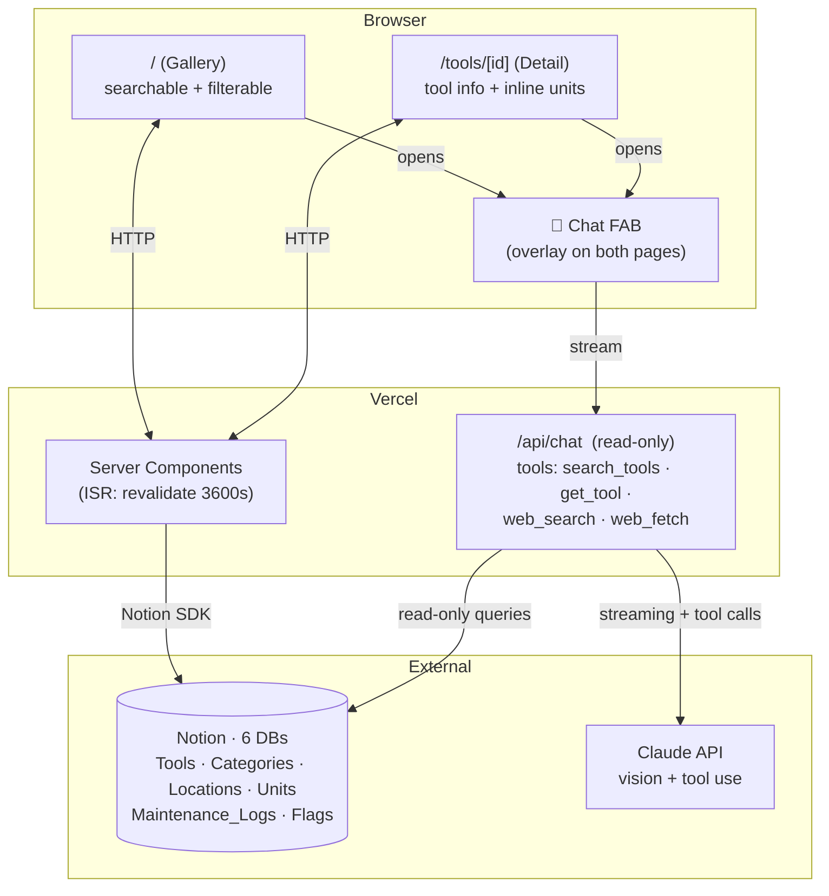

# MakerLab Tools v5 — Architecture Plan

> **Status:** Draft · **Author:** Isaac · **Date:** 2026-04-29
>
> v5 narrows the v4 surface area to **two pages plus an everywhere-chat overlay**, backed by Notion instead of AirTable. This document covers the v5 initial release. Four post-v1 phases — MCP, Maintenance/Flag forms, Student Projects, and AI-Assisted Tool Ingestion — are sketched in §4 (Roadmap).

---

## 1. Why v5

v4 works, but the data layer holds it back. Staff already live in Notion for docs, SOPs, and onboarding — keeping tool records in AirTable means double-entry whenever a tool gets a new manual or policy update, and the relations between "this tool" and "the doc page about this tool" today live as URL strings instead of real links.

v5 makes Notion the single source of truth and trims the v4 UI surface to what's actually being used: a gallery, a tool detail page, and a context-aware chat overlay. Everything else (write surfaces, MCP, Student Projects, AI ingestion) is roadmapped for subsequent phases — see §4.

---

## 2. Target Architecture (v1)



### The two pages

| Path | Purpose | Data fetched |
|---|---|---|
| `/` | **Gallery** — all tools, searchable + filterable by name / category / location / tag | All `Tools`, with resolved Categories + Locations |
| `/tools/[id]` | **Tool detail** — full info; inline list of Units for that tool | One `Tool` + its Category + Location + linked Units |

### The chat FAB (everywhere)

A floating button in the bottom-right corner of every page opens a chat overlay (sheet/modal). The chat session opens with a **context-aware system prompt** assembled server-side based on which page invoked it:

- **From Gallery:** system prompt includes a compact summary of every tool in the catalog (name, id, category, brief description). Claude can answer *"do you have a vinyl cutter?"* without needing a search call.
- **From a Tool page:** same all-tools summary, **plus** the full detail of the focal tool — its description, SOP, manual contents (where extractable), materials, PPE, training requirements. Claude behaves as a domain expert on that specific tool.

For v1, the chat is **read-only** — it can search and answer questions but cannot write to Notion. Write capability ships in phase §4.4 (AI Ingestion).

### Visual Design — "Technical Schematic"

Full design system: [`docs/MakerLab_design/DESIGN.md`](MakerLab_design/DESIGN.md). Reference HTML implementing the gallery: [`docs/MakerLab_design/code.html`](MakerLab_design/code.html). Target screenshot: [`docs/MakerLab_design/screen.png`](MakerLab_design/screen.png).

The design philosophy is **Architectural Brutalism + Blueprint Archive**: dark, industrial-editorial, uncompromising. The intent is "live engineering tool" rather than soft consumer surface — the UI should feel constructed rather than decorated.

**Color tokens** (Safety Orange primary, Cornell Crimson secondary):

| Token | Hex | Use |
|---|---|---|
| `background` | `#0F0F0F` | Base; rendered with 32px blueprint dot pattern at ~3% opacity |
| `surface-container-low` | `#131313` | Section backgrounds |
| `surface-container` | `#1A1A1A` | Cards |
| `surface-container-high` | `#2A2A2A` | Hover states / nested |
| `primary` | `#FF6B35` | Safety Orange — CTAs, focus, brand |
| `secondary` | `#B31B1B` | Cornell Crimson — heritage accents only |
| `on-surface` | `#F5F5F0` | Body text (cream, not pure white) |
| `outline` | `#2A2A2A` | Borders |

**Typography stack:**

| Role | Font | Notes |
|---|---|---|
| Display | **Space Grotesk** 500/700 | Headlines, ALL CAPS, tight tracking |
| Body | **Inter** 400/500 | Standard tracking, high legibility |
| Metadata / Labels | **JetBrains Mono** 500 | UPPERCASE, terminal-ish (`> TRAINING: ADVANCED`) |

**Hard rules** (enforced at the Tailwind-config level):

- **0px border radius everywhere** — even `rounded-full` is overridden to `0px`. The chat FAB is a square.
- **No drop shadows.** Depth through tonal layering only. The exception: a single 64px-blur ambient glow at low opacity for floating overlays.
- **No solid 1px dividers between sections.** Use surface tonality shifts.
- Snap layout to a **32px blueprint grid**.
- **Crosshair corner accents** (12px 1px lines) on featured cards / hero containers.
- Animations are snappy: 150–200ms, linear or ease-in. No bouncy / elastic.

### Gallery (`/`) — Layout Spec

Derived from `code.html`. Top to bottom:

- **Sticky top nav** — `MAKERLAB // CORNELL TECH` lockup; nav links `TOOLS / PROJECTS / ABOUT` (Projects link can be inert in v1 since the gallery is deferred to §4.3); settings + account icons.
- **Status strip** — live-counter row with pulsing dots: `● 100 TOOLS ONLINE`, `● 12 AWAITING TRAINING`, `LAB OPEN 9AM–9PM`. *(v1 simplification: may need to derive from `Units.status` and hardcode lab hours from `site-config` since real-time machine status isn't yet wired in.)*
- **Page header** — large `TOOLS // MACHINES` title in Space Grotesk uppercase, with a `my_location` material icon.
- **Search + filters bar** with crosshair-corner accents:
  - Search input prefixed with a `>` prompt glyph (terminal vibe)
  - Category filter chips (driven by `Categories` table)
  - Training filter chips (Beginner / Advanced)
  - View toggle: `[ GRID ]` / `[ TABLE ]` *(table view nice-to-have for v1; grid is the default)*
- **Card grid** — `grid-cols-1 md:grid-cols-2 xl:grid-cols-3`, 32px gap. Each card:
  - Tool image, top, `h-48`, `mix-blend-luminosity opacity-80` by default → normal blend on hover
  - Name in Space Grotesk uppercase
  - Description in Inter
  - Bottom metadata strip (JetBrains Mono): `> TRAINING: …` and `> ZONE: …`
  - Border `outline` → `primary` (orange) on hover
  - Pulsing dot in top-right for "In Use" units
- **Floating chat FAB** (bottom-right, fixed): 56×56 square, `primary` background, `>_` label in JetBrains Mono, glow shadow `0 0 40px rgba(255,107,53,0.3)`. Inverts to white-on-orange on hover.

### Tool Detail (`/tools/[id]`) — Layout Notes

Same global chrome (top nav, status strip, FAB). Page-specific additions, applying the same Technical Schematic vocabulary:

- Hero image + tool name (Space Grotesk uppercase) at top
- Spec table using JetBrains Mono labels + Inter values
- Inline `<UnitsList />` — each physical unit rendered as a row with status (pulsing dot for "In Use"), serial, condition
- Safety / PPE info treated with `secondary` (Cornell Crimson) accent for a "warning stamp" feel
- Manual / SOP / video links as JetBrains Mono chips
- Crosshair corners on the hero card

### What stays the same as v4

- Next.js 16 + React 19 + Tailwind 4 + TypeScript
- White-label site-config pattern, env-var contract
- Vercel deploy

### What's removed from v4

- QR scanner (`/scan`)
- Standalone chat page (`/chat`) — replaced by FAB overlay
- Standalone Units pages (`/units/[id]`) — units inline on tool detail
- Maintenance form (`/report`) and Flag form — UI surfaces dropped (returns in §4.2)
- Gemini image generation — `generated_image` field deprecated

---

## 3. Data Model: AirTable → Notion

### Mapping

| v4 AirTable Table  | v5 Notion Database   | Notes                                                       |
|--------------------|----------------------|-------------------------------------------------------------|
| Tools              | `Tools`              | `category`, `location` become Notion **Relation** props. Three fields removed (see below). |
| Categories         | `Categories`         | Unchanged.                                                  |
| Locations          | `Locations`          | Restructured to a 3-level hierarchy: `room → zone → id` (see below). |
| Units              | `Units`              | `tool` = Relation to `Tools`. Rendered inline on tool detail page. `qr_code_id` swapped for `uuid` (see below). |
| Maintenance_Logs   | `Maintenance_Logs`   | Schema retained; UI returns in §4.2.                        |
| Flags              | `Flags`              | Schema retained; gains a Title field (`title`); UI returns in §4.2. |

### Field-level changes (v4 → v5)

The migration is mostly a 1:1 port, but a few fields are removed, renamed, or restructured.

**`Tools` — three removals, one restructure:**

| Change | Field | Reason |
|---|---|---|
| Remove | `description_reviewed` | No AI-generated descriptions in v1 (returns with §4.4). |
| Remove | `authorized_only` | Overlaps with `training_required`. |
| Remove | `generated_image` | Gemini deprecated. |
| Restructure | `map_tag` → moves into `Locations` as `id` | The physical map identifier belongs to the spot, not the tool. See `Locations` below. |

**`Locations` — restructured to a 3-level hierarchy `room → zone → id`:**

| Field | Notion type | Notes |
|---|---|---|
| `id` | **Title** | Physical map marker, e.g., `"L-12"`. One row per physical spot in the lab. |
| `zone` | Select or Rich text | e.g., `"North Bench"`. |
| `room` | Select or Rich text | e.g., `"Wood Shop"`. |

The previous `name` (zone) field is replaced by promoting `id` to the Title slot and demoting `zone` to a regular property. Each tool relates to a single Location, and the gallery / detail page can render it as `Wood Shop → North Bench → L-12`.

Trade-off vs. keeping `location_id` as a Tool field: more Location rows up-front (one per spot, ~50–100 depending on lab size), but moving a tool is a single relation change instead of editing two fields, and "what's at L-12?" becomes a one-query lookup.

**`Units` — swap one field:**

| Change | Field | Reason |
|---|---|---|
| Remove | `qr_code_id` | Conflated identity with QR encoding. |
| Add | `uuid` | Canonical unit ID. The QR code is a *rendering* of the UUID, not a separate string. |

**`Flags` — add a Title field:**

Notion requires every database to have a Title property; v4's Flags has no obvious Title. Add `title` (Rich text, promoted to Title slot) and auto-derive it on create: `"<field_flagged> on <tool name>"` (e.g., `"description on Bambu X1"`).

### Env-var contract

Same pattern as v4 — each database ID lives behind an env var:

```
NOTION_API_KEY=secret_...
NOTION_DB_TOOLS=...
NOTION_DB_CATEGORIES=...
NOTION_DB_LOCATIONS=...
NOTION_DB_UNITS=...
NOTION_DB_MAINTENANCE_LOGS=...
NOTION_DB_FLAGS=...
```

White-labeling stays identical: a new org creates a Notion workspace, runs a setup script, pastes six IDs into `.env.local`.

### Type strategy

Keep `src/lib/types.ts` as the public shape. Introduce a thin `NotionRecord<T>` wrapper that mirrors the existing `AirtableRecord<T>`:

```ts
export interface NotionRecord<T> {
  id: string;
  createdTime: string;
  lastEditedTime: string;
  fields: T;
}
```

The existing `ToolWithMeta` (the resolved, denormalized shape used everywhere in components) doesn't change. All the component code keeps working.

### Caching — Route-level ISR

Notion's API is rate-limited (3 req/sec avg) and each `tools` page touches several related records, so we cache aggressively. Two layers do the job:

- **Route-level ISR** — every server-rendered page sets `export const revalidate = 3600`. Pages are regenerated at most once per hour per URL. Dumbest, most reliable cache strategy Next.js offers; no wrappers, no tag schemes, no webhooks. Cost: up to one hour of staleness on edits — fine for a low-traffic catalog.
- **Per-request memoization** — inside a single page render, hydrate a `Map<string, CategoryRecord>` once and reuse it. Solves the N+1 fan-out (a tool page resolves category + location + units in one render) without any cross-request infrastructure.

A future v5.x can add fine-grained tag invalidation via `unstable_cache` and a Notion webhook if staleness becomes a real complaint. Not needed for v1.

---

## 4. Roadmap (post-v1)

Four planned phases, in priority order. Each becomes its own design doc and implementation plan when picked up.

### 4.1 MCP Endpoint

Expose the catalog over the Model Context Protocol so external agents (other Claude Code sessions, IDE plugins, etc.) can query tools without going through the browser. Read-only methods: `list_tools`, `get_tool`, `search_tools`.

Lives at `/api/mcp` and reuses the same Notion fetchers as the public pages. Lowest-risk addition (no UI, no writes), so it goes first.

### 4.2 Maintenance & Flag Forms

Bring back two write surfaces that v1 dropped:

- **Maintenance reporting** — staff/students report a problem with a tool or unit. Writes to `Maintenance_Logs`.
- **Content flags** — users flag incorrect catalog info (wrong description, missing PPE, etc.). Writes to `Flags`.

Open design choice: implement these as small forms (modals on the tool detail page) **or** as chat tools (`report_maintenance`, `flag_tool`) inside the existing FAB. Tables already exist from the v1 migration, so this phase is purely about the write surface.

### 4.3 Student Projects Gallery

Add a `Projects` Notion database with a bi-directional relation to `Tools`. New routes `/projects` (gallery) and `/projects/[slug]` (detail), plus a "Projects using this tool" rail on each tool page. Adds a chat tool `search_student_projects` for chat-based discovery.

The showcase feature — a gallery of student build write-ups that exercises Notion's relational power and gives prospective students something to browse before applying.

**Sketch of `Projects` data model:**
- `title`, `slug`, `student_name` (optional), `summary`, `hero_image`, `gallery`, `body` (page content)
- `tools` — Relation to `Tools` (many-to-many, bi-directional)
- `keywords` (multi-select), `difficulty` (beginner/intermediate/advanced), `featured` (checkbox)

Detailed design (full data model, layout sketches, integration points) will be its own doc when this phase is picked up.

### 4.4 AI-Assisted Tool Ingestion (via Chat FAB)

The chat FAB gains write capability: drop a photo (and optionally some text or a product URL), the AI identifies the product via vision, web-searches for canonical info, scrapes the seller page, and proposes a complete tool record. User confirms in chat → the row gets created in Notion as an unpublished draft.

#### Who & Why

Anyone — student, intern, or admin — can add inventory through the chat. The AI does the heavy lifting (identification, data gathering, image fetching) so the user only has to confirm or correct. This makes the chat *both* an output surface ("what tools do you have?") and an input surface ("here's a new one") through the same UI.

#### The Safety Boundary — Drafts Then Publish (Hard Policy)

The chatbot can write drafts but **cannot publish**. Enforced at the tool-surface level, not in prompt instructions:

- A new `published` checkbox on the `Tools` Notion DB defaults to `false`. (Schema migration ships with this phase; existing tools backfilled to `true` so nothing disappears from the public site.)
- The chat has one new write tool (`create_tool_draft`) that always sets `published: false`.
- **No `publish_tool` or `set_published` tool exists.** Publishing happens exclusively in Notion, by an admin, by checking the box.
- Pages query Notion with a `published = true` filter, so drafts never appear in the gallery or detail pages.

This is stronger than telling the model "please don't publish" — no system-prompt jailbreak can grant a capability that doesn't exist in the function-calling schema. Acts as a vetting gate for chat-created content.

#### The AI Workflow — Vision + Web Search + Scrape

Three native Claude capabilities do the analysis; we add **one** custom write tool:

| Capability | Source | Role |
|---|---|---|
| Vision | Built into Claude (sees image in conversation) | Identify the product from the photo. |
| `web_search` | Already wired in v1 chat | Find the canonical product page (manufacturer site, McMaster, Bambu, etc.). |
| `web_fetch` | Anthropic built-in tool | Scrape the canonical page for specs, materials, manual links, hero image URL. |
| `create_tool_draft` | **New custom tool** | Write the draft row to Notion (atomic: also creates a new Category if the AI proposed one). |

#### Conversation Flow

**Happy path:**

> **User (chat FAB on gallery):** *[attaches photo of a printer on a workbench]* "add this to the catalog"
>
> **Claude:** *(sees image natively → identifies "Bambu Lab X1 Carbon" → calls `web_search` → calls `web_fetch` on the manufacturer page)*
>   "Here's a draft:
>   - **Name:** Bambu Lab X1 Carbon
>   - **Category:** 3D Printing → Filament Printers *(matched existing)*
>   - **Description:** Enclosed CoreXY 3D printer with auto bed leveling…
>   - **Materials:** PLA, PETG, ABS, PA-CF
>   - **PPE:** Safety glasses recommended near hot end
>   - **Hero image:** 
>   - **Manual:** [PDF](…)
>
>   *Location is blank — set it in Notion when you publish.*
>
>   Save this as a draft? Reply 'yes' or tell me what to change."
>
> **User:** "yes"
>
> **Claude:** *(calls `create_tool_draft({ ... published: false })`)*
>   "Done. [Open in Notion to review and publish →](https://notion.so/...)"

Refinement happens in chat (no Notion writes until confirm). Category creation is atomic with tool creation. The AI's chosen `hero_image_url` is server-side downloaded and uploaded to Notion's file property, so the catalog stays self-contained.

#### Tool Spec — `create_tool_draft`

```ts
{
  name: "create_tool_draft",
  description:
    "Create a new tool draft in the Notion catalog with published=false. " +
    "Only call after the user has explicitly confirmed they want to save the proposed draft. " +
    "Never call this without an explicit user confirmation in the most recent turn. " +
    "If proposed_new_category is set, server will create the Category row first, then link it.",
  input_schema: {
    type: "object",
    required: ["name"],
    properties: {
      name:                  { type: "string" },
      description:           { type: "string" },
      category_id:           { type: "string", description: "Notion page ID of an existing Category, or null." },
      proposed_new_category: { type: "string", description: "If category_id is null, the human-readable name of the category to create." },
      materials:             { type: "array", items: { type: "string" } },
      ppe_required:          { type: "array", items: { type: "string" } },
      training_required:     { type: "boolean" },
      authorized_only:       { type: "boolean" },
      use_restrictions:      { type: "string" },
      hero_image_url:        { type: "string", description: "Server downloads and attaches to image_attachments." },
      manual_url:            { type: "string" },
      manufacturer_url:      { type: "string" },
      tags:                  { type: "array", items: { type: "string" } }
    }
  }
}
```

#### Open Questions for This Phase

- Rate-limiting `create_tool_draft` calls (anti-abuse / accidental-bulk).
- Markdown preview (simplest) vs. rich card UI in chat with inline edit.
- Cleanup workflow for orphan Categories the AI created and got remapped/abandoned.
- Should chat-created drafts be visible to *anyone* (transparent) or hidden from the public site until published (current plan)? Current plan is hidden, but a "drafts pending review" page might be useful.

---

## 5. Out of Scope

Truly off the v5 plan (not roadmapped, not promised):

- **Bulk ingestion** — drag-and-drop a folder of 30 photos → 30 drafts. May happen well after §4.4.
- **Auth-gated chat writes** — the drafts-then-publish gate (§4.4) is the v1 mitigation; tighter auth would be a separate effort.
- **Notion → Vercel webhook for cache invalidation** — route-level ISR is the v1 stand-in; revisit if staleness becomes a real complaint.
- **Image optimization beyond Notion** — Notion hosts images with 1-hour signed URLs; a Vercel Blob proxy can come later if needed.
- **Image generation (Gemini).** v4's `generated_image` field is deprecated.
- **Analytics** — which tools get viewed, which AI drafts get published vs discarded.

---

## 6. Open Questions (v1)

1. **Migration cutover** — dual-write for a week, then switch reads, then drop AirTable? Or big-bang on a quiet day?
2. **Manual-PDF parsing for tool-page chat context** — when injecting tool-specific context for the chat FAB on a tool page, do we extract text from the linked manual PDF, or just include the URL? Extraction is richer but slower and expensive on cold renders.
3. **Chat session continuity across pages** — if a user opens the chat on the gallery, then navigates to a tool page, does the chat session reset (new context) or persist? Defaulting to reset keeps context coherent; persisting feels more app-like.

---

## 7. Suggested Build Order (v1)

> (High-level only — a separate plan will break each phase into tasks.)

1. **Notion migration** — port the 6 existing tables, applying the field-level changes from §3. Validate data fidelity against the v4 AirTable.
2. **`src/lib/notion.ts`** — replace `src/lib/airtable.ts` behind the same `ToolWithMeta` shape.
3. **Design system foundation** — port the `tailwind.config` from `docs/MakerLab_design/code.html` (color tokens, font stack, 0px radius enforcement, blueprint background pattern). Add the three Google Fonts to `app/layout.tsx`.
4. **Global chrome** — sticky top nav + status strip components. Hardcode lab hours; derive counts from Notion where possible.
5. **Build `/` (gallery)** — server-rendered list with search + filter, applying the gallery layout from §2. ISR revalidate 3600s.
6. **Build `/tools/[id]` (detail)** — full tool info, inline `<UnitsList />`, applying the detail layout from §2. ISR revalidate 3600s.
7. **Build `<ChatFAB />` component** — square 56×56 button with glow, overlay sheet. Mounts on both pages.
8. **Server-side context assembly** — endpoint that builds the chat's system prompt based on `mode: 'gallery' | 'tool'` and an optional `tool_id`.
9. **Polish & dogfood** — empty states, error handling, mobile layout. Walk through 5 real user flows.

---

*Earlier v5 drafts included Student Projects, AI Ingestion, and several supporting screens as v1 features. The current plan narrows v1 to gallery + detail + read-only chat overlay; everything else is roadmapped in §4. See git history for the prior scope.*
