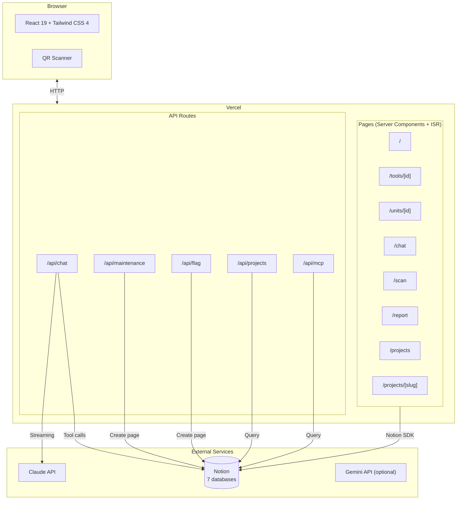

# MakerLab Tools v5 — Architecture Plan

> **Status:** Draft · **Author:** Isaac · **Date:** 2026-04-21
>
> This document describes two related changes planned for v5:
> 1. Migrating the data layer from **AirTable → Notion**.
> 2. Adding a new **Student Projects** section (scaffold only — not implemented in this plan).

---

## 1. Why v5

v4 works, but two friction points keep showing up:

- **AirTable is a data silo.** Staff already live in Notion for docs, SOPs, and onboarding. Keeping tool records in a separate system means double-entry whenever a tool gets a new manual, a new safety doc, or a policy update. Relations between "this tool" and "the doc page about this tool" today live as URL strings, not real links.
- **The catalog is read-mostly, but writes (maintenance reports, flags) need a human-friendly review surface.** AirTable's grid is great for that. Notion's database views + comments are arguably better, since reviewers can discuss individual reports inline.

The v5 migration moves the source of truth to Notion while preserving the v4 Next.js frontend, the Claude chat tool-calling, and the MCP endpoint.

The new `Student Projects` section is the first feature built natively on the Notion-backed layer — it exercises relations (tools ↔ projects) and rich content (project write-ups as blog-style pages).

---

## 2. Target Architecture



**What changes:**
- `src/lib/airtable.ts` → `src/lib/notion.ts` (same public shape; different backend).
- New `/projects` routes and `/api/projects` route.
- Chat route gets a new tool: `search_student_projects`.
- MCP gets two new methods: `list_projects`, `get_project`.

**What stays the same:**
- Page structure, component library, theming, site-config.
- Claude chat UX, QR scanner, maintenance form.
- Vercel deploy, env-var pattern for white-labeling.

---

## 3. Data Model: AirTable → Notion

### Mapping

| v4 AirTable Table  | v5 Notion Database   | Notes                                                       |
|--------------------|----------------------|-------------------------------------------------------------|
| Tools              | `Tools`              | `category`, `location` become Notion **Relation** props.    |
| Categories         | `Categories`         | Unchanged.                                                  |
| Locations          | `Locations`          | Unchanged.                                                  |
| Units              | `Units`              | `tool` = Relation to `Tools`.                               |
| Maintenance_Logs   | `Maintenance_Logs`   | `unit` = Relation. Photos → Notion file property.           |
| Flags              | `Flags`              | `tool` = Relation.                                          |
| *(new)*            | `Projects`           | See §4. `tools` = Relation to `Tools` (bi-directional).     |

### Env-var contract

Keep the same pattern as v4 — each database ID lives behind an env var:

```
NOTION_API_KEY=secret_...
NOTION_DB_TOOLS=...
NOTION_DB_CATEGORIES=...
NOTION_DB_LOCATIONS=...
NOTION_DB_UNITS=...
NOTION_DB_MAINTENANCE_LOGS=...
NOTION_DB_FLAGS=...
NOTION_DB_PROJECTS=...
```

This keeps white-labeling identical: a new org creates a Notion workspace, runs a setup script, and pastes seven IDs into `.env.local`.

### Type strategy

Keep `src/lib/types.ts` as the public shape. Introduce a thin `NotionRecord<T>` wrapper that mirrors the existing `AirtableRecord<T>`:

```ts
export interface NotionRecord<T> {
  id: string;
  createdTime: string;
  lastEditedTime: string;
  fields: T;
}
```

The existing `ToolWithMeta` (the resolved, denormalized shape used everywhere in components) doesn't change. All the component code keeps working.

### Caching — Vercel Data Cache

Notion's API is rate-limited (3 req/sec avg), and each `tools` page already touches several related records (category, location, units). Three layers, each doing a different job:

- **Vercel Data Cache via `unstable_cache`** — wrap every Notion fetcher (`getTools`, `getTool`, `getCategories`, `getProjects`, `getProject`, etc.) in `unstable_cache` with **tag-based revalidation**. The cache is shared across all requests and survives deploys (it's part of Vercel's build output, not in-memory per lambda). Tag scheme:
  - `tools` · `tools:${id}`
  - `categories` · `locations` · `units`
  - `projects` · `projects:${slug}`
  - `maintenance` · `flags`
- **Revalidation** — a `/api/revalidate` webhook receives Notion database change events (or, simpler for v5.0: a cron job every 15 minutes) and calls `revalidateTag("tools")` etc. to drop stale entries. The default TTL is 1 hour as a safety net.
- **Per-request memoization** — inside a single page render, hydrate a `Map<string, CategoryRecord>` once and reuse it. This handles the N+1 inside a single response; Vercel Data Cache handles deduplication across responses.

This gets us closer to AirTable's effective latency without the write-contention issues AirTable has above 5 req/sec.

---

## 4. New Feature: Student Projects (Scaffold)

### User Stories

- **Student Priya** opens the laser cutter page. She scrolls down past the specs and sees a grid of 6 photos — "Projects made with this tool." She taps one, reads the build write-up, and notices it also used the CNC router. She taps that chip and ends up on the CNC page.
- **Lab manager Joel** asks the chat: *"What are some good student projects for a beginner to see before using the laser cutter?"* Claude calls `search_student_projects({ tool_id: "tool_laser_cutter", difficulty: "beginner" })`, gets three projects back, and summarizes each with a link.
- **Prospective student Sam** opens `/projects` to browse the gallery before applying. He filters by "wood" and finds the Cornell Maker Club build.

### Data model — `Projects` database

| Field           | Type                          | Notes                                                                    |
|-----------------|-------------------------------|--------------------------------------------------------------------------|
| `title`         | Title                         | "Kinetic Sand Table"                                                      |
| `slug`          | Rich text (URL-safe)          | Used for `/projects/[slug]`.                                              |
| `student_name`  | Rich text                     | Optional; may be omitted for privacy.                                     |
| `summary`       | Rich text (≤240 chars)        | Shown on cards and in chat responses.                                     |
| `hero_image`    | Files & media                 | Primary photo. Shown on card + top of detail page.                        |
| `gallery`       | Files & media (multi)         | Additional photos for the detail page.                                    |
| `body`          | Notion page body              | The blog-style writeup lives as page children, not a DB field.            |
| `tools`         | **Relation → Tools**          | Many-to-many, bi-directional. Drives both sides of the UI.                |
| `keywords`      | Multi-select                  | "kinetic," "wood," "arduino," "lighting." Used for filtering + chat search. |
| `difficulty`    | Select                        | "beginner" · "intermediate" · "advanced".                                 |
| `featured`      | Checkbox                      | Show on home page / featured rail.                                        |
| `created_at`    | Created time                  | Auto.                                                                     |

**On the Tools database, add a corresponding Relation column** `projects` (the other side of `projects.tools`). Notion populates this automatically once the relation is marked bidirectional — no sync code required.

### Routes & components (to scaffold)

```
src/app/projects/
├── page.tsx                    # Gallery index — grid of ProjectCards with filters
└── [slug]/page.tsx             # Detail page — hero, body, tool chips, keyword chips

src/app/api/projects/
└── route.ts                    # GET (list + filters) for client-side filter UI & MCP

src/components/
├── ProjectCard.tsx             # Photo + title + summary + 2–3 tool chips
├── ProjectToolChips.tsx        # Linked chips (→ /tools/[id])
├── ProjectKeywordChips.tsx     # Non-linked chips; click filters the gallery
└── ToolProjectsSection.tsx     # Rendered on /tools/[id] — "Projects using this tool"
```

**Integration point in existing code:**
- `src/app/tools/[id]/page.tsx` — add `<ToolProjectsSection toolId={tool.id} />` near the bottom of the page.

### Project Detail Page — Layout Sketch

```
┌────────────────────────────────────────────────┐
│  [hero image — full bleed]                     │
├────────────────────────────────────────────────┤
│  Kinetic Sand Table                            │
│  by Priya S. · intermediate · Mar 2026         │
│                                                │
│  Tools used:                                   │
│  [Laser Cutter] [CNC Router] [Arduino Kit]     │
│                                                │
│  Keywords:                                     │
│  [kinetic] [wood] [arduino] [lighting]         │
├────────────────────────────────────────────────┤
│  ## How I built it                             │
│  I started with a 24×24 plywood base…          │
│  (Notion page body rendered as Markdown)       │
│                                                │
│  [gallery photo]   [gallery photo]             │
│                                                │
│  ## What I'd do differently                    │
│  …                                             │
└────────────────────────────────────────────────┘
```

### Tool Page — Integration Sketch

Appended to the bottom of each tool detail page:

```
─── Student Projects ──────────────────────────────
[card] [card] [card] [card]   →  (View all N)
```

Each card is a `ProjectCard`. Clicking a card → `/projects/[slug]`. "View all" → `/projects?tool=<toolId>`.

### AI Chat Integration

Add one new tool-use function to `src/app/api/chat/route.ts`:

```ts
{
  name: "search_student_projects",
  description:
    "Search student projects in the gallery. Use when the user asks for examples of projects, " +
    "projects made with a specific tool, or projects tagged with a theme/material.",
  input_schema: {
    type: "object",
    properties: {
      tool_id:    { type: "string", description: "Filter by projects that used this tool." },
      keyword:    { type: "string", description: "Filter by keyword (matches any of the project's keywords)." },
      difficulty: { type: "string", enum: ["beginner", "intermediate", "advanced"] },
      limit:      { type: "number", default: 5 },
    },
  },
}
```

Claude will pick this up automatically from the user's question. No system-prompt changes needed beyond mentioning that student projects are now part of the catalog.

Example interactions the tool enables:

| User asks                                         | Claude calls                                                  |
|---------------------------------------------------|---------------------------------------------------------------|
| *"What can I build with the laser cutter?"*       | `search_student_projects({ tool_id: "recXYZ" })`              |
| *"Show me beginner-friendly wood projects."*      | `search_student_projects({ keyword: "wood", difficulty: "beginner" })` |
| *"What tools did Priya use for the sand table?"*  | `get_project({ slug: "kinetic-sand-table" })` → extracts tool IDs → `get_tool` per ID |

### MCP Integration

Expose two new methods in `src/app/api/mcp/route.ts`:

- `list_projects({ tool_id?, keyword?, difficulty?, limit? })` — paginated list.
- `get_project({ slug })` — full detail, including tool relations and markdown body.

This lets external agents (and other Claude Code sessions) query the gallery without a browser.

---

## 5. Out of Scope for This Plan

Intentionally *not* addressed here — would each be their own plan:

- **Student authentication** — who can submit a project, how moderation works.
- **Project submission form** — a `/projects/new` page with upload + tool picker.
- **Notion → Vercel webhook** — cache invalidation on Notion edits.
- **Image optimization** — Notion hosts images with 1-hour signed URLs; a v5.1 task will need a proxy or re-upload-to-Vercel-blob strategy.
- **Analytics** — which projects get viewed, which tool queries fail.

---

## 6. Open Questions

1. **Privacy default for student_name** — opt-in or opt-out? Proposed: opt-in (blank by default).
2. **Who writes project pages?** — Staff from student photo submissions, or students directly in Notion? Affects whether we need a submission UI now vs later.
3. **Categories for keywords** — freeform multi-select, or a curated vocabulary? Freeform is faster; curated keeps the filter UI clean.
4. **Migration cutover** — dual-write for a week, then switch reads, then drop AirTable? Or big-bang on a quiet day?

---

## 7. Suggested Build Order

> (High-level only — a separate plan will break each phase into tasks.)

1. Notion migration — port the 6 existing tables, keep `/projects` stubbed.
2. Add `Projects` database + types + `getProjects()` / `getProject(slug)`.
3. Build `/projects` and `/projects/[slug]` with the layouts sketched in §4.
4. Add `<ToolProjectsSection />` to the tool detail page.
5. Wire `search_student_projects` into the chat route.
6. Expose `list_projects` / `get_project` via MCP.
7. Seed with 3–5 real projects, review, iterate copy/UX.

---

*See also: `makerlab-v5-architecture.png` (root of repo) for the diagrammed version of §2.*
